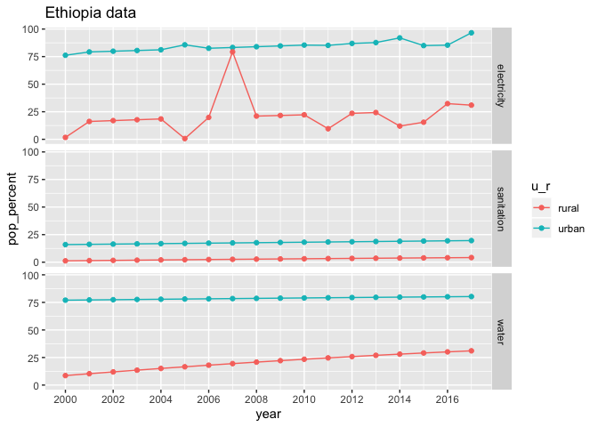
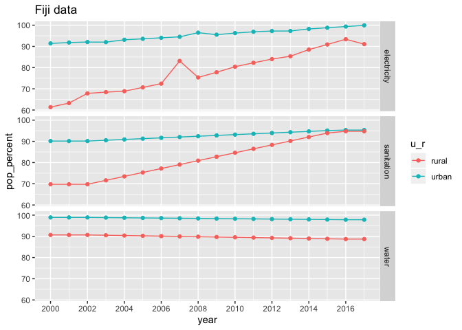
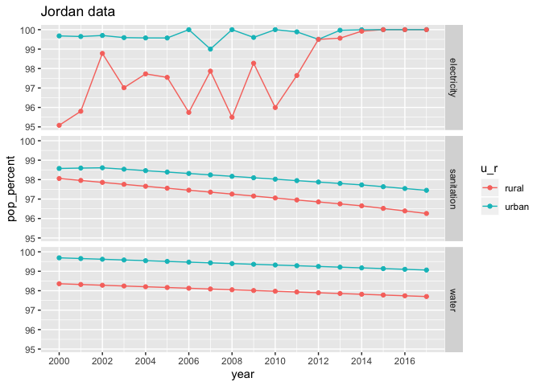
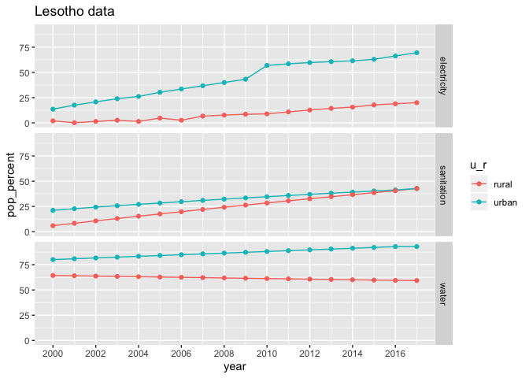
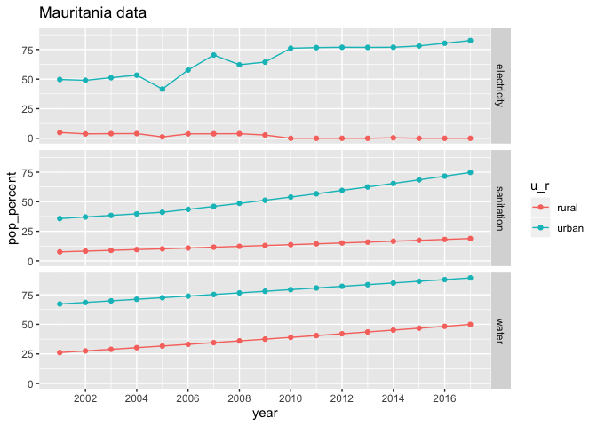
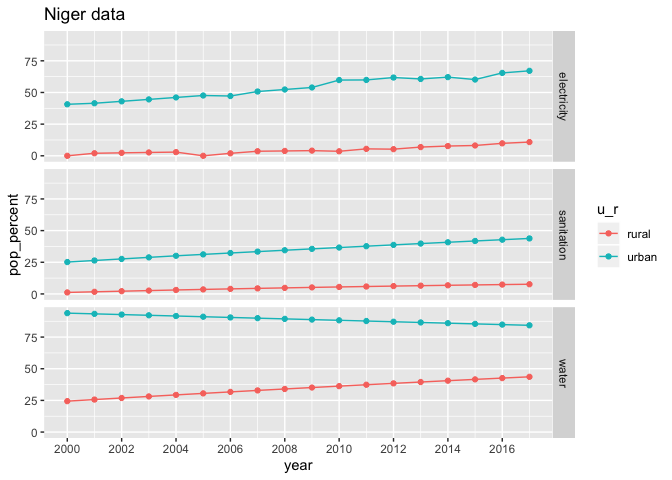
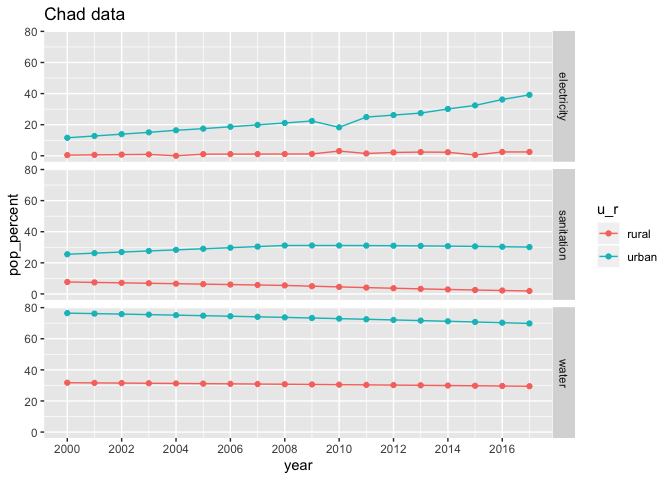
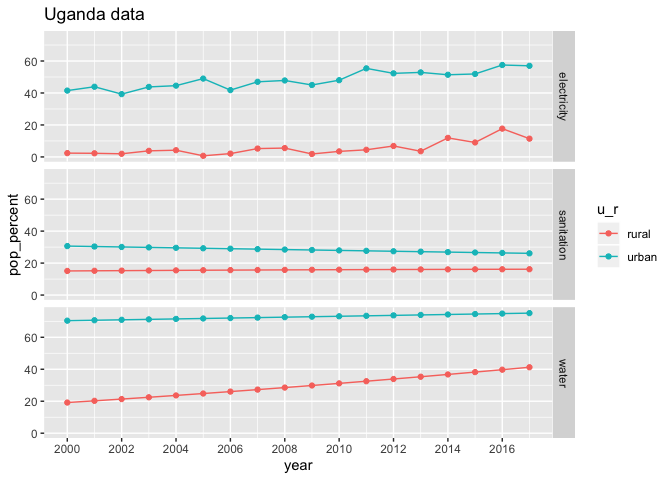
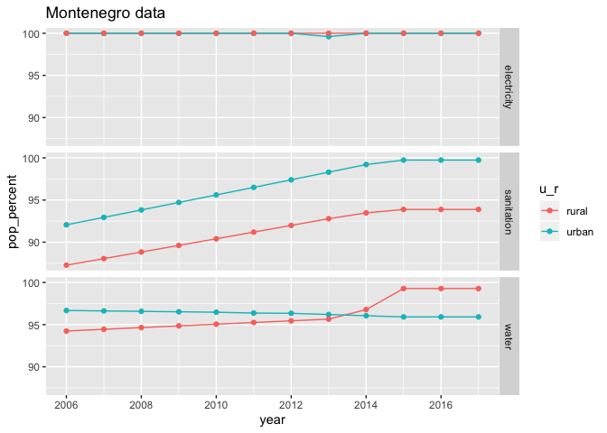

Infrastructure
================
Ada Zhou
2020-02-18

  - [Checking Data](#checking-data)
  - [Tidying Data](#tidying-data)
  - [Mexico Data](#mexico-data)
  - [World Infrastructure Data](#world-infrastructure-data)
  - [Difference between urban and rural infrastructure in
    regions](#difference-between-urban-and-rural-infrastructure-in-regions)
  - [Sanitation](#sanitation)
  - [Countries where percent population with access to infrastructure
    decreased](#countries-where-percent-population-with-access-to-infrastructure-decreased)
  - [Decreasing Infrastructure](#decreasing-infrastructure)
  - [Mean Decrease by infrastructure](#mean-decrease-by-infrastructure)
  - [Maps](#maps)
  - [Correlation between variables](#correlation-between-variables)
  - [Rural \> Urban](#rural-urban)

``` r
# Libraries
library(tidyverse)
library(sf)

# Parameters
file_data <- here::here("c01-own/data/infrastructure.rds")
map_file_path <- 
    here::here(
        "../../archive/ne_110m_admin_0_countries/ne_110m_admin_0_countries.shp"
    )
world_regions <- 
  c(
    "8S",
    "ZG",
    "Z4",
    "ZQ",
    "Z7",
    "ZJ",
    "XU"
  )

group_codes <- 
  c(
    "1A",
    "S3",
    "B8",
    "V2",
    "Z4",
    "4E",
    "T4",
    "XC",
    "Z7",
    "7E",
    "T7",
    "EU",
    "F1",
    "XE",
    "XD",
    "XF",
    "ZT",
    "XH",
    "XI",
    "XG",
    "V3",
    "ZJ",
    "XJ",
    "T2",
    "XL",
    "XO",
    "XM",
    "XN",
    "ZQ",
    "XQ",
    "T3",
    "XP", #MIDDLE INCOME
    "XU",
    "XY",
    "OE",
    "S4",
    "S2",
    "V4",
    "V1",
    "S1",
    "8S",
    "T5",
    "ZG",
    "ZF",
    "T6",
    "XT", #UPPER MIDDLE INCOME
    "1W"
  )

#===============================================================================

df <- read_rds(file_data)

countries <- read_sf(map_file_path)
```

### Checking Data

``` r
df %>% 
  summary()
```

    ##     iso2c             country               year      electricity_urban
    ##  Length:15840       Length:15840       Min.   :1960   Min.   :  3.50   
    ##  Class :character   Class :character   1st Qu.:1975   1st Qu.: 89.59   
    ##  Mode  :character   Mode  :character   Median :1990   Median : 99.60   
    ##                                        Mean   :1990   Mean   : 90.18   
    ##                                        3rd Qu.:2004   3rd Qu.:100.00   
    ##                                        Max.   :2019   Max.   :100.00   
    ##                                                       NA's   :9821     
    ##  electricity_rural  water_urban      water_rural      sanitation_urban 
    ##  Min.   :  0.00    Min.   : 49.49   Min.   :  4.083   Min.   :  9.432  
    ##  1st Qu.: 46.32    1st Qu.: 88.96   1st Qu.: 56.178   1st Qu.: 57.496  
    ##  Median : 94.96    Median : 96.57   Median : 81.388   Median : 86.536  
    ##  Mean   : 72.96    Mean   : 92.69   Mean   : 74.774   Mean   : 76.226  
    ##  3rd Qu.:100.00    3rd Qu.: 99.36   3rd Qu.: 96.788   3rd Qu.: 97.219  
    ##  Max.   :100.00    Max.   :100.00   Max.   :100.000   Max.   :100.000  
    ##  NA's   :9848      NA's   :11898    NA's   :12066     NA's   :11932    
    ##  sanitation_rural
    ##  Min.   :  1.19  
    ##  1st Qu.: 29.78  
    ##  Median : 64.23  
    ##  Mean   : 60.09  
    ##  3rd Qu.: 92.82  
    ##  Max.   :100.00  
    ##  NA's   :12057

``` r
df %>% 
  count(
    electricity_urban_na = is.na(electricity_urban),
    electricity_rural_na = is.na(electricity_rural),
    water_urban_na = is.na(water_urban),
    water_rural_na = is.na(water_rural),
    sanitation_urban_na = is.na(sanitation_urban),
    sanitation_rural_na = is.na(sanitation_rural)
  ) 
```

    ## # A tibble: 17 x 7
    ##    electricity_urb… electricity_rur… water_urban_na water_rural_na
    ##    <lgl>            <lgl>            <lgl>          <lgl>         
    ##  1 FALSE            FALSE            FALSE          FALSE         
    ##  2 FALSE            FALSE            FALSE          FALSE         
    ##  3 FALSE            FALSE            FALSE          TRUE          
    ##  4 FALSE            FALSE            FALSE          TRUE          
    ##  5 FALSE            FALSE            FALSE          TRUE          
    ##  6 FALSE            FALSE            TRUE           TRUE          
    ##  7 FALSE            FALSE            TRUE           TRUE          
    ##  8 FALSE            TRUE             FALSE          FALSE         
    ##  9 FALSE            TRUE             FALSE          TRUE          
    ## 10 FALSE            TRUE             TRUE           TRUE          
    ## 11 TRUE             FALSE            FALSE          FALSE         
    ## 12 TRUE             FALSE            TRUE           TRUE          
    ## 13 TRUE             TRUE             FALSE          FALSE         
    ## 14 TRUE             TRUE             FALSE          FALSE         
    ## 15 TRUE             TRUE             FALSE          TRUE          
    ## 16 TRUE             TRUE             TRUE           TRUE          
    ## 17 TRUE             TRUE             TRUE           TRUE          
    ## # … with 3 more variables: sanitation_urban_na <lgl>,
    ## #   sanitation_rural_na <lgl>, n <int>

### Tidying Data

``` r
df <- 
  df %>% 
  drop_na(
    electricity_urban, 
    electricity_rural,
    water_urban,
    water_rural,
    sanitation_urban,
    sanitation_rural
  ) %>% 
  pivot_longer(
    cols = c(contains("urban"), contains("rural")),
    names_to = c("infrastructure", "u_r"),
    names_sep = "_",
    values_to = "pop_percent"
  )
```

### Mexico Data

``` r
df %>% 
  filter(country == "Mexico") %>% 
  ggplot(aes(year, pop_percent, color = infrastructure)) +
  geom_point() +
  facet_wrap(vars(u_r))
```

<!-- -->

### World Infrastructure Data

``` r
#world
df %>% 
  filter(iso2c == "1W", year == "2017") %>% 
  ggplot(aes(x = infrastructure, y = pop_percent, fill = u_r)) +
  geom_col(position = "dodge")
```

<!-- -->

``` r
df %>% 
  filter(
    iso2c %in% world_regions
  ) %>% 
  ggplot(aes(year, pop_percent, color = country)) +
  geom_line() +
  facet_grid(rows = vars(infrastructure), cols = vars(u_r))
```

<!-- -->

### Difference between urban and rural infrastructure in regions

``` r
df %>%
  pivot_wider(
    names_from = c(u_r, infrastructure), 
    values_from = pop_percent
  ) %>% 
  mutate(
    e_diff = urban_electricity - rural_electricity,
    w_diff = urban_water - rural_water,
    s_diff = urban_sanitation - rural_sanitation
  ) %>% 
  filter(
    iso2c %in% world_regions
  ) %>% 
  drop_na(e_diff, w_diff, s_diff) %>%
  select(iso2c, country, year, contains("diff")) %>% 
  pivot_longer(
    cols = contains("diff"),
    names_to = "difference",
    values_to = "value"
  ) %>% 
  ggplot(aes(x = year, y = value, color = country)) +
  geom_line() +
  facet_grid(rows = vars(difference))
```

<!-- -->

### Sanitation

``` r
lowest_sanitation_rural <- 
  df %>% 
  filter(
    !(iso2c %in% group_codes), 
    infrastructure == "sanitation",
    u_r == "rural",
    year == max(year, na.rm = TRUE)
  ) %>% 
  top_n(-50, pop_percent) %>% 
  pull(iso2c)

df %>% 
  filter(
    iso2c %in% lowest_sanitation_rural,
    u_r == "rural",
    infrastructure == "sanitation"
  ) %>% 
  pivot_wider(
    names_from = year,
    names_prefix = "year_",
    values_from = "pop_percent"
  ) %>% 
  mutate(country = fct_reorder(country, year_2017)) %>% 
  drop_na(year_2007) %>%  
  ggplot(aes(y = country)) +
  geom_vline(aes(xintercept = median(year_2017)), color = "blue") +
  geom_vline(aes(xintercept = median(year_2007)), color = "red") +
  geom_segment(
    aes(
      x = year_2007, 
      xend = year_2017, 
      y = country, 
      yend = country
    )
  ) +
  geom_point(aes(x = year_2007, color = "2007")) +
  geom_point(aes(x = year_2017, color = "2017"))
```

<!-- -->

``` r
lowest_sanitation_urban <- 
  df %>% 
  filter(
    !(iso2c %in% group_codes), 
    infrastructure == "sanitation",
    u_r == "urban",
    year == max(year, na.rm = TRUE)
  ) %>% 
  top_n(-50, pop_percent) %>% 
  pull(iso2c)

df %>% 
  filter(
    iso2c %in% lowest_sanitation_rural,
    u_r == "urban",
    infrastructure == "sanitation"
  ) %>% 
  pivot_wider(
    names_from = year,
    names_prefix = "year_",
    values_from = "pop_percent"
  ) %>% 
  mutate(country = fct_reorder(country, year_2017)) %>% 
  drop_na(year_2007) %>%  
  ggplot(aes(y = country)) +
  geom_vline(aes(xintercept = median(year_2017)), color = "blue") +
  geom_vline(aes(xintercept = median(year_2007)), color = "red") +
  geom_segment(
    aes(
      x = year_2007, 
      xend = year_2017, 
      y = country, 
      yend = country
    )
  ) +
  geom_point(aes(x = year_2007, color = "2007")) +
  geom_point(aes(x = year_2017, color = "2017"))
```

<!-- -->

### Countries where percent population with access to infrastructure decreased

``` r
decreased <- 
  df %>% 
  unite("variable", infrastructure, u_r) %>% 
  filter(year %in% c("2007", "2017")) %>% 
  group_by(iso2c, country, variable) %>% 
  arrange(iso2c, country, variable, year) %>% 
  summarize(change = last(pop_percent, year) - first(pop_percent, year)) %>%
  ungroup() %>% 
  ungroup() %>% 
  filter(change < 0) 

graph_country <- function(iso2c, country) {
  df %>% 
    filter(
      iso2c == {{iso2c}}
    ) %>% 
    ggplot(aes(x = year, y = pop_percent, color = u_r)) +
    geom_line() +
    geom_point() +
    facet_grid(rows = vars(infrastructure)) +
    scale_x_continuous(breaks = scales::breaks_width(2)) +
    labs(
      title = str_glue("{country} data")
    )
}

decrease_plots <- 
  decreased %>% 
  filter(abs(change) > 1) %>% 
  distinct(iso2c, country) %>%
  pmap(graph_country)

decrease_plots %>% walk(print)
```

<!-- --><!-- --><!-- --><!-- --><!-- --><!-- --><!-- --><!-- --><!-- --><!-- --><!-- --><!-- --><!-- --><!-- --><!-- --><!-- --><!-- --><!-- --><!-- --><!-- --><!-- --><!-- --><!-- --><!-- --><!-- --><!-- --><!-- --><!-- --><!-- --><!-- --><!-- --><!-- --><!-- --><!-- --><!-- --><!-- --><!-- --><!-- --><!-- --><!-- --><!-- --><!-- --><!-- --><!-- --><!-- --><!-- --><!-- --><!-- --><!-- --><!-- --><!-- --><!-- -->

### Decreasing Infrastructure

``` r
graph_variable_decrease <- function(variable) {
  df %>% 
    unite("variable", infrastructure, u_r) %>% 
    filter(
      variable == {{variable}},
      year > 2006,
      iso2c %in% 
        (decreased %>% 
           filter(variable == {{variable}}, abs(change) > 1) %>% 
           pull(iso2c)
        ),
      !(iso2c %in% group_codes)
    ) %>% 
    ggplot(aes(year, pop_percent, color = country)) +
    geom_line() +
    geom_point() +
    scale_x_continuous(breaks = scales::breaks_width(1)) +
    labs(
      title = str_glue("Countries with decreasing {variable}")
    )
}

graph_variable_decrease("electricity_rural")
```

<!-- -->

``` r
graph_variable_decrease("electricity_urban")
```

<!-- -->

``` r
graph_variable_decrease("water_rural")
```

<!-- -->

``` r
graph_variable_decrease("water_urban")
```

<!-- -->

``` r
graph_variable_decrease("sanitation_rural")
```

<!-- -->

``` r
graph_variable_decrease("sanitation_urban")
```

<!-- -->

``` r
decreased %>%
  filter(!(iso2c %in% group_codes)) %>% 
  count(variable) %>% 
  ggplot(aes(fct_reorder(variable, n), n)) + 
  geom_col() +
  labs(
    title = "Number of countries with a decrease in population percent access to infrastructure"
  )
```

<!-- -->

### Mean Decrease by infrastructure

``` r
decreased %>%
  filter(!(iso2c %in% group_codes)) %>%
  group_by(variable) %>% 
  summarize(mean = mean(change)) %>% 
  ggplot(aes(fct_reorder(variable, mean), mean)) + 
  geom_col()
```

<!-- -->

``` r
df %>% 
  unite("variable", infrastructure, u_r) %>% 
  filter(year %in% c("2007", "2017")) %>% 
  group_by(iso2c, country, variable) %>% 
  arrange(iso2c, country, variable, year) %>% 
  summarize(change = last(pop_percent, year) - first(pop_percent, year)) %>% 
  filter(!(iso2c %in% group_codes)) %>%
  group_by(variable) %>% 
  summarize(mean = mean(change)) %>% 
  ggplot(aes(fct_reorder(variable, mean), mean)) + 
  geom_col()
```

<!-- -->

``` r
# India
 df %>% 
  filter(
    iso2c == "IN"
  ) %>% 
  ggplot(aes(x = year, y = pop_percent, color = infrastructure)) +
  geom_line() +
  geom_point() +
  facet_wrap(vars(u_r)) +
  scale_x_continuous(breaks = scales::breaks_width(2)) +
  theme(legend.position = "bottom")
```

<!-- -->

``` r
top_bottom <- function(infrastructure, u_r, n) {
  df %>%
  filter(
    !(iso2c %in% group_codes),
    infrastructure == {{infrastructure}},
    year == 2017,
    u_r == {{u_r}}
  ) %>% 
  top_n(n, pop_percent) %>% 
  arrange(desc(pop_percent))
}

top_bottom("electricity", "urban", -10)
```

    ## # A tibble: 10 x 6
    ##    iso2c country                    year infrastructure u_r   pop_percent
    ##    <chr> <chr>                     <int> <chr>          <chr>       <dbl>
    ##  1 BI    Burundi                    2017 electricity    urban        61.8
    ##  2 MW    Malawi                     2017 electricity    urban        57.5
    ##  3 UG    Uganda                     2017 electricity    urban        57  
    ##  4 CD    Congo, Dem. Rep.           2017 electricity    urban        49.2
    ##  5 SL    Sierra Leone               2017 electricity    urban        48.7
    ##  6 GW    Guinea-Bissau              2017 electricity    urban        48.3
    ##  7 SS    South Sudan                2017 electricity    urban        42.1
    ##  8 TD    Chad                       2017 electricity    urban        39.2
    ##  9 KP    Korea, Dem. People’s Rep.  2017 electricity    urban        38.6
    ## 10 LR    Liberia                    2017 electricity    urban        36.0

``` r
top_bottom("sanitation", "urban", -10)
```

    ## # A tibble: 10 x 6
    ##    iso2c country           year infrastructure u_r   pop_percent
    ##    <chr> <chr>            <int> <chr>          <chr>       <dbl>
    ##  1 TG    Togo              2017 sanitation     urban        28.6
    ##  2 LR    Liberia           2017 sanitation     urban        27.7
    ##  3 CG    Congo, Rep.       2017 sanitation     urban        27.2
    ##  4 BJ    Benin             2017 sanitation     urban        26.5
    ##  5 UG    Uganda            2017 sanitation     urban        26.1
    ##  6 SL    Sierra Leone      2017 sanitation     urban        25.7
    ##  7 GH    Ghana             2017 sanitation     urban        23.7
    ##  8 CD    Congo, Dem. Rep.  2017 sanitation     urban        23.4
    ##  9 ET    Ethiopia          2017 sanitation     urban        19.6
    ## 10 MG    Madagascar        2017 sanitation     urban        17.8

``` r
top_bottom("water", "urban", -10)
```

    ## # A tibble: 10 x 6
    ##    iso2c country            year infrastructure u_r   pop_percent
    ##    <chr> <chr>             <int> <chr>          <chr>       <dbl>
    ##  1 GQ    Equatorial Guinea  2017 water          urban        78.1
    ##  2 CM    Cameroon           2017 water          urban        77.3
    ##  3 SL    Sierra Leone       2017 water          urban        75.8
    ##  4 BJ    Benin              2017 water          urban        75.7
    ##  5 UG    Uganda             2017 water          urban        75.1
    ##  6 SD    Sudan              2017 water          urban        73.8
    ##  7 AO    Angola             2017 water          urban        71.2
    ##  8 TD    Chad               2017 water          urban        69.8
    ##  9 CD    Congo, Dem. Rep.   2017 water          urban        69.3
    ## 10 SS    South Sudan        2017 water          urban        64.8

``` r
top_bottom("electricity", "rural", -10)
```

    ## # A tibble: 10 x 6
    ##    iso2c country           year infrastructure u_r   pop_percent
    ##    <chr> <chr>            <int> <chr>          <chr>       <dbl>
    ##  1 SL    Sierra Leone      2017 electricity    rural        5.35
    ##  2 MW    Malawi            2017 electricity    rural        3.71
    ##  3 HT    Haiti             2017 electricity    rural        2.75
    ##  4 TD    Chad              2017 electricity    rural        2.49
    ##  5 MZ    Mozambique        2017 electricity    rural        2.18
    ##  6 BI    Burundi           2017 electricity    rural        1.66
    ##  7 AO    Angola            2017 electricity    rural        0   
    ##  8 CD    Congo, Dem. Rep.  2017 electricity    rural        0   
    ##  9 MG    Madagascar        2017 electricity    rural        0   
    ## 10 MR    Mauritania        2017 electricity    rural        0

``` r
top_bottom("sanitation", "rural", -10)
```

    ## # A tibble: 10 x 6
    ##    iso2c country           year infrastructure u_r   pop_percent
    ##    <chr> <chr>            <int> <chr>          <chr>       <dbl>
    ##  1 PG    Papua New Guinea  2017 sanitation     rural        7.69
    ##  2 NE    Niger             2017 sanitation     rural        7.65
    ##  3 BJ    Benin             2017 sanitation     rural        7.62
    ##  4 TG    Togo              2017 sanitation     rural        7.40
    ##  5 MG    Madagascar        2017 sanitation     rural        6.33
    ##  6 CG    Congo, Rep.       2017 sanitation     rural        6.26
    ##  7 LR    Liberia           2017 sanitation     rural        5.89
    ##  8 SS    South Sudan       2017 sanitation     rural        5.19
    ##  9 ET    Ethiopia          2017 sanitation     rural        4.19
    ## 10 TD    Chad              2017 sanitation     rural        1.89

``` r
top_bottom("water", "rural", -10)
```

    ## # A tibble: 10 x 6
    ##    iso2c country            year infrastructure u_r   pop_percent
    ##    <chr> <chr>             <int> <chr>          <chr>       <dbl>
    ##  1 MG    Madagascar         2017 water          rural        36.3
    ##  2 BF    Burkina Faso       2017 water          rural        35.0
    ##  3 SS    South Sudan        2017 water          rural        34.9
    ##  4 PG    Papua New Guinea   2017 water          rural        34.6
    ##  5 ET    Ethiopia           2017 water          rural        31.1
    ##  6 GQ    Equatorial Guinea  2017 water          rural        30.8
    ##  7 TD    Chad               2017 water          rural        29.5
    ##  8 SO    Somalia            2017 water          rural        28.1
    ##  9 AO    Angola             2017 water          rural        27.4
    ## 10 CD    Congo, Dem. Rep.   2017 water          rural        22.8

``` r
graphs_top_bottom <- function(infrastructure, u_r, n) {
  df %>% 
  filter(
    iso2c %in% top_bottom({{infrastructure}}, {{u_r}}, n)$iso2c,
    u_r == {{u_r}}
  ) %>% 
  ggplot(aes(x = year, y = pop_percent, color = infrastructure)) +
  geom_line() +
  facet_wrap(vars(country), ncol = 2) +
  theme(legend.position = "bottom")
}

graphs_top_bottom("electricity", "rural", -10)
```

<!-- -->

``` r
graphs_top_bottom("sanitation", "rural", -10)
```

<!-- -->

``` r
graphs_top_bottom("water", "rural", -10)
```

<!-- -->

``` r
graphs_top_bottom("electricity", "urban", -10)
```

<!-- -->

``` r
graphs_top_bottom("sanitation", "urban", -10)
```

<!-- -->

``` r
graphs_top_bottom("water", "urban", -10)
```

<!-- -->

### Maps

``` r
country_df <- 
  df %>% 
  pivot_wider(
    names_from = c(infrastructure, u_r), 
    values_from = pop_percent
  ) %>% 
  left_join(countries, ., by = c("ISO_A2" = "iso2c"))


maps_infrastructure <- function(infrastructure, year) {
  country_df %>% 
    filter(year == {{year}}) %>% 
    ggplot() +
    geom_sf(aes(fill = {{infrastructure}})) +
    scale_fill_viridis_c(labels = scales::label_percent(scale = 1)) +
    guides(
      fill = 
        guide_colorbar(
          barheight = 0.5,
          barwidth = 15,
          title = NULL
        )
    ) +
    theme_void() +
    theme(legend.position = "bottom") 
}

maps_infrastructure(electricity_urban, 2017) + 
  labs(title = "Percent of Urban Population with Access to Electricity")
```

<!-- -->

``` r
maps_infrastructure(electricity_rural, 2017) +
  labs(title = "Percent of Rural Population with Access to Electricity")
```

<!-- -->

``` r
maps_infrastructure(sanitation_urban, 2017) +
  labs(title = "Percent of Urban Population with Sanitation")
```

<!-- -->

``` r
maps_infrastructure(sanitation_rural, 2017) +
  labs(title = "Percent of Rural Population with Sanitation")
```

<!-- -->

``` r
maps_infrastructure(water_urban, 2017) +
  labs(title = "Percent of Urban Population with Access to Water")
```

<!-- -->

``` r
maps_infrastructure(water_rural, 2017) +
  labs(title = "Percent of Rural Population with Access to Water")
```

<!-- -->

### Correlation between variables

``` r
df %>% 
  pivot_wider(
    names_from = u_r,
    values_from = pop_percent
  ) %>% 
  filter(year == "2017") %>% 
  drop_na(urban, rural) %>% 
  ggplot(aes(urban, rural)) +
  geom_abline(slope = 1, color = "light blue") +
  geom_point(alpha = 0.7) +
  facet_grid(cols = vars(infrastructure)) +
  coord_fixed()
```

<!-- -->

### Rural \> Urban

``` r
rural_greater <- 
  df %>% 
  pivot_wider(
    names_from = u_r,
    values_from = pop_percent
  ) %>% 
  filter(
    rural - urban > 1
  )

rural_greater %>% 
  distinct(iso2c, country, infrastructure) %>% 
  knitr::kable()
```

| iso2c | country                   | infrastructure |
| :---- | :------------------------ | :------------- |
| BA    | Bosnia and Herzegovina    | water          |
| BI    | Burundi                   | sanitation     |
| BY    | Belarus                   | sanitation     |
| BY    | Belarus                   | water          |
| CU    | Cuba                      | sanitation     |
| GM    | Gambia, The               | sanitation     |
| IE    | Ireland                   | sanitation     |
| IE    | Ireland                   | water          |
| IS    | Iceland                   | sanitation     |
| JM    | Jamaica                   | sanitation     |
| KG    | Kyrgyz Republic           | sanitation     |
| KM    | Comoros                   | water          |
| KP    | Korea, Dem. People’s Rep. | electricity    |
| KZ    | Kazakhstan                | sanitation     |
| LC    | St. Lucia                 | sanitation     |
| LC    | St. Lucia                 | electricity    |
| LK    | Sri Lanka                 | sanitation     |
| LU    | Luxembourg                | sanitation     |
| ME    | Montenegro                | water          |
| MH    | Marshall Islands          | water          |
| MK    | North Macedonia           | electricity    |
| MK    | North Macedonia           | water          |
| MU    | Mauritius                 | electricity    |
| MV    | Maldives                  | water          |
| NL    | Netherlands               | sanitation     |
| RS    | Serbia                    | water          |
| RW    | Rwanda                    | sanitation     |
| SK    | Slovak Republic           | water          |
| SV    | El Salvador               | electricity    |
| SZ    | Eswatini                  | sanitation     |
| TH    | Thailand                  | sanitation     |
| TJ    | Tajikistan                | sanitation     |
| TM    | Turkmenistan              | sanitation     |
| TO    | Tonga                     | water          |
| TR    | Turkey                    | water          |
| TV    | Tuvalu                    | sanitation     |
| UA    | Ukraine                   | water          |
| WS    | Samoa                     | water          |

``` r
rural_greater %>% 
  distinct(iso2c, country, infrastructure) %>% 
  ggplot(aes(infrastructure)) +
  geom_bar()
```

<!-- -->

``` r
rural_greater_plots <- 
  rural_greater %>% 
  distinct(iso2c, country) %>%
  pmap(graph_country)

rural_greater_plots %>% walk(print)
```

<!-- --><!-- --><!-- --><!-- --><!-- --><!-- --><!-- --><!-- --><!-- --><!-- --><!-- --><!-- --><!-- --><!-- --><!-- --><!-- --><!-- --><!-- --><!-- --><!-- --><!-- --><!-- --><!-- --><!-- --><!-- --><!-- --><!-- --><!-- --><!-- --><!-- --><!-- --><!-- --><!-- --><!-- -->
