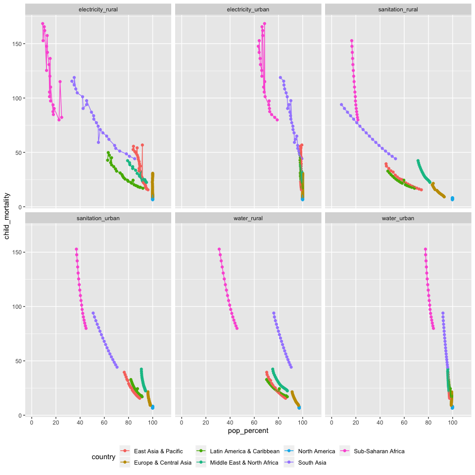

Child Mortality and Infrastructure
================
Ada Zhou
2020-02-23

``` r
# Libraries
library(tidyverse)

# Parameters
file_data <- here::here("c01-own/data/infrastructure_child_mortality.rds")

world_regions <- 
  c(
    "8S",
    "ZG",
    "Z4",
    "ZQ",
    "Z7",
    "ZJ",
    "XU"
  )

group_codes <- 
  c(
    "1A",
    "S3",
    "B8",
    "V2",
    "Z4",
    "4E",
    "T4",
    "XC",
    "Z7",
    "7E",
    "T7",
    "EU",
    "F1",
    "XE",
    "XD",
    "XF",
    "ZT",
    "XH",
    "XI",
    "XG",
    "V3",
    "ZJ",
    "XJ",
    "T2",
    "XL",
    "XO",
    "XM",
    "XN",
    "ZQ",
    "XQ",
    "T3",
    "XP", #MIDDLE INCOME
    "XU",
    "XY",
    "OE",
    "S4",
    "S2",
    "V4",
    "V1",
    "S1",
    "8S",
    "T5",
    "ZG",
    "ZF",
    "T6",
    "XT", #UPPER MIDDLE INCOME
    "1W"
  )

#===============================================================================

df <- read_rds(file_data)
```

``` r
plot_relationship <- function(infrastructure) {
  df %>% 
  drop_na({{infrastructure}}, child_mortality) %>%
  filter(iso2c %in% world_regions) %>% 
  ggplot(aes({{infrastructure}}, child_mortality, color = country)) +
  geom_point() +
  geom_line()
}

df %>% 
  pivot_longer(
    cols = c(contains("urban"), contains("rural")),
    names_to = "infrastructure",
    values_to = "pop_percent"
  ) %>% 
  drop_na(child_mortality, pop_percent) %>% 
  filter(iso2c %in% world_regions) %>% 
  arrange(year) %>% 
  ggplot(aes(pop_percent, child_mortality, color = country)) +
  geom_point() +
  geom_line() +
  facet_wrap(vars(infrastructure)) +
  scale_x_continuous(
    breaks = seq(0, 100, by = 20),
    limits = c(0, 110),
    minor_breaks = NULL
  ) +
  theme(legend.position = "bottom") 
```

<!-- -->

``` r
# ggrepel::geom_text_repel(
#     data = . %>% group_by(infrastructure, iso2c) %>% filter(year == max(year)), 
#     aes(label = country)
#   )
```
