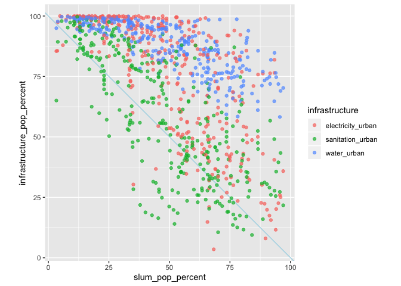
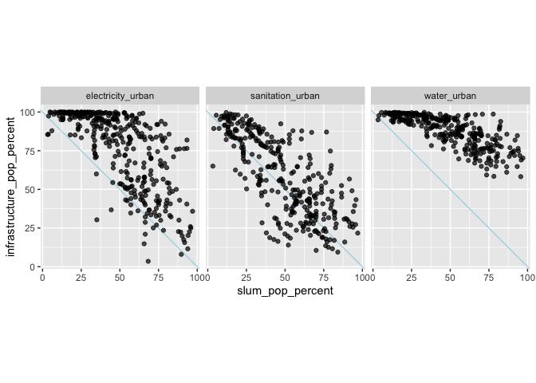

Infrastructure and Slum Population
================
Ada
2020-02-18

  - [Correlation](#correlation)

``` r
# Libraries
library(tidyverse)

# Parameters
file_data <- here::here("c01-own/data/infrastructure_slum_pop_percent.rds")

world_regions <- 
  c(
    "8S",
    "ZG",
    "Z4",
    "ZQ",
    "Z7",
    "ZJ",
    "XU"
  )

group_codes <- 
  c(
    "1A",
    "S3",
    "B8",
    "V2",
    "Z4",
    "4E",
    "T4",
    "XC",
    "Z7",
    "7E",
    "T7",
    "EU",
    "F1",
    "XE",
    "XD",
    "XF",
    "ZT",
    "XH",
    "XI",
    "XG",
    "V3",
    "ZJ",
    "XJ",
    "T2",
    "XL",
    "XO",
    "XM",
    "XN",
    "ZQ",
    "XQ",
    "T3",
    "XP", #MIDDLE INCOME
    "XU",
    "XY",
    "OE",
    "S4",
    "S2",
    "V4",
    "V1",
    "S1",
    "8S",
    "T5",
    "ZG",
    "ZF",
    "T6",
    "XT", #UPPER MIDDLE INCOME
    "1W"
  )

#===============================================================================

df <- read_rds(file_data)
```

### Correlation

``` r
df %>% 
  filter(
    !(iso2c %in% group_codes)
  ) %>% 
  select(-contains("rural")) %>% 
  pivot_longer(
    cols = contains("urban"),
    names_to = "infrastructure",
    values_to = "infrastructure_pop_percent"
  ) %>% 
  drop_na(slum_pop_percent, infrastructure_pop_percent) %>% 
  ggplot(
    aes(slum_pop_percent, infrastructure_pop_percent, color = infrastructure)
  ) +
  geom_abline(slope = -1, intercept = 100, color = "light blue") +
  geom_point(alpha = 0.7) +
  coord_fixed()
```

<!-- -->

``` r
df %>% 
  filter(
    !(iso2c %in% group_codes)
  ) %>% 
  select(-contains("rural")) %>% 
  pivot_longer(
    cols = contains("urban"),
    names_to = "infrastructure",
    values_to = "infrastructure_pop_percent"
  ) %>% 
  drop_na(slum_pop_percent, infrastructure_pop_percent) %>% 
  ggplot(
    aes(slum_pop_percent, infrastructure_pop_percent)
  ) +
  geom_abline(slope = -1, intercept = 100, color = "light blue") +
  geom_point(alpha = 0.7) +
  facet_grid(cols = vars(infrastructure)) +
  coord_fixed()
```

<!-- -->
