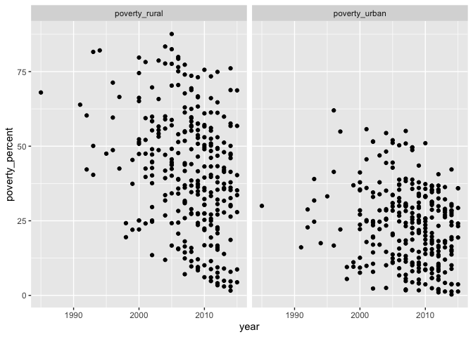
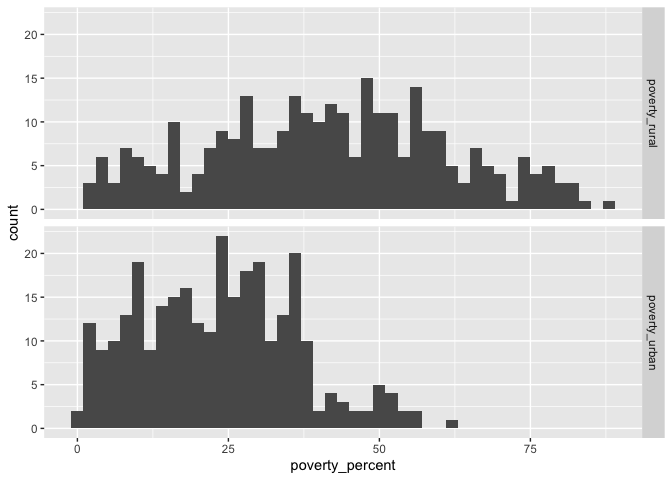
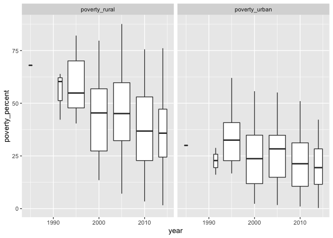
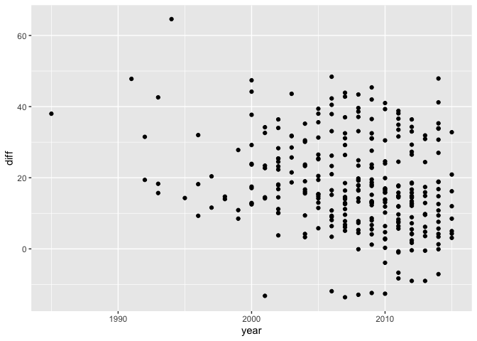

Poverty
================
Ada
2020-02-18

``` r
# Libraries
library(tidyverse)

# Parameters
file_data <- here::here("c01-own/data/poverty.rds")
#===============================================================================

df <- read_rds(file_data)
```

``` r
df %>% 
  summary()
```

    ##     iso2c             country               year      poverty_urban  
    ##  Length:15840       Length:15840       Min.   :1960   Min.   : 0.30  
    ##  Class :character   Class :character   1st Qu.:1975   1st Qu.:12.60  
    ##  Mode  :character   Mode  :character   Median :1990   Median :23.50  
    ##                                        Mean   :1990   Mean   :23.43  
    ##                                        3rd Qu.:2004   3rd Qu.:33.00  
    ##                                        Max.   :2019   Max.   :62.00  
    ##                                                       NA's   :15525  
    ##  poverty_rural  
    ##  Min.   : 1.60  
    ##  1st Qu.:26.15  
    ##  Median :41.60  
    ##  Mean   :41.11  
    ##  3rd Qu.:55.65  
    ##  Max.   :87.60  
    ##  NA's   :15541

``` r
df %>% 
  drop_na(poverty_urban, poverty_rural) %>% 
  pivot_longer(
    cols = contains("poverty"),
    names_to = "u_r",
    values_to = "poverty_percent"
  ) %>% 
  ggplot(aes(year, poverty_percent)) +
  geom_point() +
  facet_wrap(vars(u_r))
```

<!-- -->

``` r
df %>% 
  drop_na(poverty_urban, poverty_rural) %>%
  pivot_longer(
    cols = contains("poverty"),
    names_to = "u_r",
    values_to = "poverty_percent"
  ) %>% 
  ggplot(aes(poverty_percent)) +
  geom_histogram(binwidth = 2) +
  facet_grid(rows = vars(u_r))
```

<!-- -->

``` r
df %>% 
  drop_na(poverty_urban, poverty_rural) %>% 
  pivot_longer(
    cols = contains("poverty"),
    names_to = "u_r",
    values_to = "poverty_percent"
  ) %>% 
  ggplot(aes(year, poverty_percent)) +
  geom_boxplot(aes(group = cut_width(year, 5)), position = "dodge") +
  facet_grid(cols = vars(u_r)) 
```

<!-- -->

``` r
df %>% 
  drop_na(poverty_urban, poverty_rural) %>% 
  mutate(
    diff = poverty_rural - poverty_urban
  ) %>% 
  ggplot(aes(year, diff)) +
  geom_point()
```

<!-- -->
