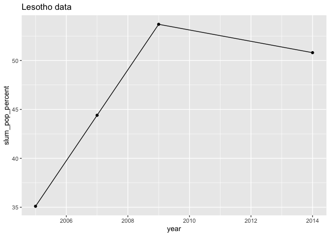
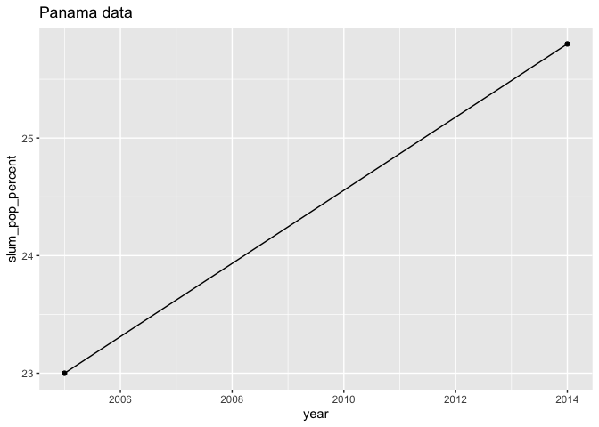

Percent of population living in slums
================
Ada Zhou
2020-02-18

  - [Check Data](#check-data)
  - [Region](#region)
  - [Individual country data](#individual-country-data)
  - [Increase in slum population](#increase-in-slum-population)

``` r
# Libraries
library(tidyverse)

# Parameters
file_data <- here::here("c01-own/data/slum_pop_percent.rds")

world_regions <- 
  c(
    "8S",
    "ZG",
    "Z4",
    "ZQ",
    "Z7",
    "ZJ",
    "XU"
  )

group_codes <- 
  c(
    "1A",
    "S3",
    "B8",
    "V2",
    "Z4",
    "4E",
    "T4",
    "XC",
    "Z7",
    "7E",
    "T7",
    "EU",
    "F1",
    "XE",
    "XD",
    "XF",
    "ZT",
    "XH",
    "XI",
    "XG",
    "V3",
    "ZJ",
    "XJ",
    "T2",
    "XL",
    "XO",
    "XM",
    "XN",
    "ZQ",
    "XQ",
    "T3",
    "XP", #MIDDLE INCOME
    "XU",
    "XY",
    "OE",
    "S4",
    "S2",
    "V4",
    "V1",
    "S1",
    "8S",
    "T5",
    "ZG",
    "ZF",
    "T6",
    "XT", #UPPER MIDDLE INCOME
    "1W"
  )

#===============================================================================

df <- read_rds(file_data)
```

### Check Data

``` r
df %>% 
  summary()
```

    ##     iso2c             country          slum_pop_percent      year     
    ##  Length:15840       Length:15840       Min.   : 3.30    Min.   :1960  
    ##  Class :character   Class :character   1st Qu.:31.91    1st Qu.:1975  
    ##  Mode  :character   Mode  :character   Median :47.80    Median :1990  
    ##                                        Mean   :48.74    Mean   :1990  
    ##                                        3rd Qu.:65.42    3rd Qu.:2004  
    ##                                        Max.   :98.90    Max.   :2019  
    ##                                        NA's   :15216

``` r
df %>% 
  distinct(iso2c) %>% 
  count()
```

    ## # A tibble: 1 x 1
    ##       n
    ##   <int>
    ## 1   264

``` r
df %>% 
  filter(is.na(slum_pop_percent)) %>% 
  count(year) 
```

    ## # A tibble: 60 x 2
    ##     year     n
    ##    <int> <int>
    ##  1  1960   264
    ##  2  1961   264
    ##  3  1962   264
    ##  4  1963   264
    ##  5  1964   264
    ##  6  1965   264
    ##  7  1966   264
    ##  8  1967   264
    ##  9  1968   264
    ## 10  1969   264
    ## # … with 50 more rows

``` r
df <- 
  df %>% 
  drop_na(slum_pop_percent)

df %>% 
  count(year) 
```

    ## # A tibble: 7 x 2
    ##    year     n
    ##   <int> <int>
    ## 1  1990    88
    ## 2  1995    71
    ## 3  2000    73
    ## 4  2005   118
    ## 5  2007    88
    ## 6  2009    74
    ## 7  2014   112

### Region

``` r
df %>% 
  filter(iso2c %in% world_regions) %>% 
  ggplot(aes(year, slum_pop_percent, color = country)) +
  geom_line() +
  geom_point()
```

<!-- -->

### Individual country data

``` r
df %>% 
  filter(!(iso2c %in% group_codes)) %>% 
  count(country)
```

    ## # A tibble: 106 x 2
    ##    country                 n
    ##    <chr>               <int>
    ##  1 Afghanistan             1
    ##  2 Algeria                 1
    ##  3 Angola                  5
    ##  4 Antigua and Barbuda     2
    ##  5 Argentina               7
    ##  6 Armenia                 1
    ##  7 Bangladesh              7
    ##  8 Belize                  2
    ##  9 Benin                   7
    ## 10 Bhutan                  1
    ## # … with 96 more rows

``` r
df %>% 
  filter(!(iso2c %in% group_codes)) %>% 
  count(year)
```

    ## # A tibble: 7 x 2
    ##    year     n
    ##   <int> <int>
    ## 1  1990    60
    ## 2  1995    48
    ## 3  2000    49
    ## 4  2005    85
    ## 5  2007    61
    ## 6  2009    50
    ## 7  2014    83

``` r
df %>% 
  filter(
    !(iso2c %in% group_codes),
    year %in% c("2005", "2014")
  ) %>%
  pivot_wider(
    names_from = year, 
    names_prefix = "year_", 
    values_from = slum_pop_percent
  ) %>% 
  drop_na(year_2014, year_2005) %>% 
  mutate(
    country = fct_reorder(country, year_2014),
    diff = year_2014 - year_2005
  ) %>% 
  top_n(30, year_2014) %>% 
  ggplot(aes(y = country)) +
  geom_vline(aes(xintercept = median(year_2005), color = "2005")) +
  geom_vline(aes(xintercept = median(year_2014), color = "2014")) +
  geom_segment(
    aes(
      x = year_2005, 
      xend = year_2014, 
      y = country, 
      yend = country
    )
  ) +
  geom_point(aes(x = year_2014, color = "2014")) +
  geom_point(aes(x = year_2005, color = "2005")) 
```

<!-- -->

### Increase in slum population

``` r
greatest_change <- 
  df %>% 
  filter(
    !(iso2c %in% group_codes),
    year %in% c("2005", "2014")
  ) %>%
  pivot_wider(
    names_from = year, 
    names_prefix = "year_", 
    values_from = slum_pop_percent
  ) %>% 
  drop_na(year_2014, year_2005) %>% 
  mutate(
    country = fct_reorder(country, year_2014),
    diff = year_2014 - year_2005
  ) %>% 
  filter(diff > 0)

graph_country <- function(iso2c, country) {
  df %>% 
    filter(
      iso2c == {{iso2c}}
    ) %>% 
    drop_na(slum_pop_percent) %>% 
    ggplot(aes(x = year, y = slum_pop_percent)) +
    geom_line() +
    geom_point() +
    scale_x_continuous(breaks = scales::breaks_width(2)) +
    labs(
      title = str_glue("{country} data")
    )
}

greatest_change_plots <- 
  greatest_change %>% 
  select(iso2c, country) %>% 
  pmap(graph_country)

greatest_change_plots %>% walk(print)
```

<!-- --><!-- --><!-- --><!-- --><!-- --><!-- --><!-- --><!-- --><!-- --><!-- --><!-- --><!-- --><!-- -->

``` r
df %>% 
  filter(country == "India") %>% 
  drop_na(slum_pop_percent) %>% 
  ggplot(aes(year, slum_pop_percent)) +
  geom_line() +
  geom_point() +
  labs(
    title = "Percent of Population Living in Slums in India"
  )
```

<!-- -->

``` r
df %>% 
  filter(country == "Mexico") %>% 
  drop_na(slum_pop_percent) %>% 
  ggplot(aes(year, slum_pop_percent)) +
  geom_line() +
  geom_point() +
  labs(
    title = "Percent of Population Living in Slums in Mexico"
  )
```

<!-- -->

``` r
df_avg_change <- 
  df %>% 
  drop_na(slum_pop_percent) %>% 
  filter(!(iso2c %in% group_codes)) %>% 
  group_by(iso2c) %>% 
  arrange(iso2c, year) %>% 
  mutate(
    slum_pop_percent_next = lead(slum_pop_percent),
    slum_pop_percent_diff = slum_pop_percent_next - slum_pop_percent,
    year_next = lead(year),
    year_diff = year_next - year,
    avg_change = slum_pop_percent_diff / year_diff
  ) %>% 
  drop_na(year_diff, avg_change) %>% 
  ungroup()

df_top_increase <- 
  df_avg_change %>% 
  top_n(10, avg_change)

df_top_decrease <- 
  df_avg_change %>% 
  top_n(-10, avg_change)

df_top_increase %>% 
  bind_rows(df_top_decrease) %>% 
  mutate(
    country = fct_reorder(as.factor(country), avg_change),
    facet = if_else(avg_change > 0, "Increase", "Decrease")
  ) %>% 
  ggplot(aes(y = country)) +
  geom_segment(
    aes(
      x = slum_pop_percent, 
      xend = slum_pop_percent + avg_change, 
      y = country, 
      yend = country
    ),
    arrow = arrow(length = unit(0.1, "cm"))
  ) +
  geom_point(aes(x = slum_pop_percent), color = "red", size = 0.8) +
  facet_wrap(vars(facet), ncol = 1, scales = "free_y")
```

<!-- -->

``` r
df %>% 
  filter(
    !(iso2c %in% group_codes),
    year == "2014"
  ) %>%
  top_n(-50, slum_pop_percent)
```

    ##    iso2c              country slum_pop_percent year
    ## 1     AR            Argentina             16.7 2014
    ## 2     AM              Armenia             14.4 2014
    ## 3     BZ               Belize             10.8 2014
    ## 4     BO              Bolivia             43.5 2014
    ## 5     BR               Brazil             22.3 2014
    ## 6     CM             Cameroon             37.8 2014
    ## 7     CN                China             25.2 2014
    ## 8     CO             Colombia             13.1 2014
    ## 9     CG          Congo, Rep.             46.9 2014
    ## 10    CR           Costa Rica              5.5 2014
    ## 11    DO   Dominican Republic             12.1 2014
    ## 12    EC              Ecuador             36.0 2014
    ## 13    EG     Egypt, Arab Rep.             10.6 2014
    ## 14    SZ             Eswatini             32.7 2014
    ## 15    GA                Gabon             37.0 2014
    ## 16    GM          Gambia, The             34.8 2014
    ## 17    GH                Ghana             37.9 2014
    ## 18    GT            Guatemala             34.5 2014
    ## 19    GN               Guinea             43.3 2014
    ## 20    GY               Guyana             33.1 2014
    ## 21    HN             Honduras             27.5 2014
    ## 22    IN                India             24.0 2014
    ## 23    ID            Indonesia             21.8 2014
    ## 24    IQ                 Iraq             47.2 2014
    ## 25    JO               Jordan             12.9 2014
    ## 26    LA              Lao PDR             31.4 2014
    ## 27    LS              Lesotho             50.8 2014
    ## 28    MX               Mexico             11.1 2014
    ## 29    MN             Mongolia             42.7 2014
    ## 30    MA              Morocco             13.1 2014
    ## 31    MM              Myanmar             41.0 2014
    ## 32    NA              Namibia             33.2 2014
    ## 33    NG              Nigeria             50.2 2014
    ## 34    PK             Pakistan             45.5 2014
    ## 35    PA               Panama             25.8 2014
    ## 36    PE                 Peru             34.2 2014
    ## 37    PH          Philippines             38.3 2014
    ## 38    RW               Rwanda             53.2 2014
    ## 39    SN              Senegal             39.4 2014
    ## 40    ZA         South Africa             23.0 2014
    ## 41    SR             Suriname              7.3 2014
    ## 42    SY Syrian Arab Republic             19.3 2014
    ## 43    TZ             Tanzania             50.7 2014
    ## 44    TH             Thailand             25.0 2014
    ## 45    TG                 Togo             51.2 2014
    ## 46    TN              Tunisia              8.0 2014
    ## 47    TR               Turkey             11.9 2014
    ## 48    UG               Uganda             53.6 2014
    ## 49    VN              Vietnam             27.2 2014
    ## 50    ZW             Zimbabwe             25.1 2014
