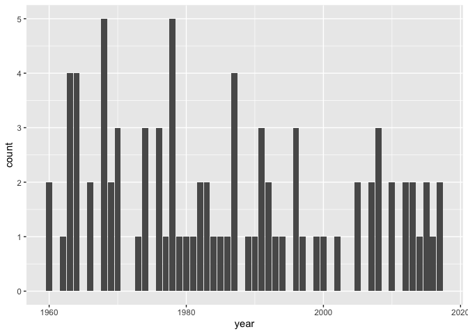
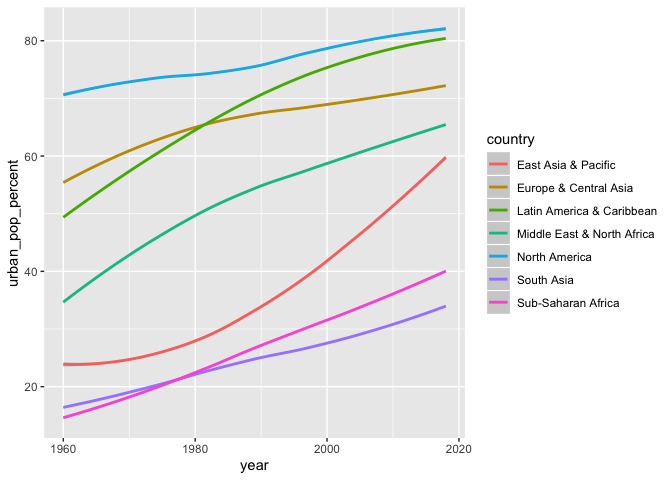
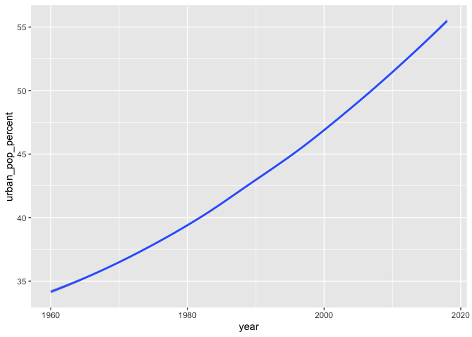

Urban Population Percentage
================
Ada Zhou
2020-02-03

``` r
# Libraries
library(tidyverse)

# Parameters
file_data <- here::here("c01-own/data/urban_pop_percent.rds")

world_regions <- 
  c(
    "8S",
    "ZG",
    "Z4",
    "ZQ",
    "Z7",
    "ZJ",
    "XU"
  )

group_codes <- 
  c(
    "1A",
    "S3",
    "B8",
    "V2",
    "Z4",
    "4E",
    "T4",
    "XC",
    "Z7",
    "7E",
    "T7",
    "EU",
    "F1",
    "XE",
    "XD",
    "XF",
    "ZT",
    "XH",
    "XI",
    "XG",
    "V3",
    "ZJ",
    "XJ",
    "T2",
    "XL",
    "XO",
    "XM",
    "XN",
    "ZQ",
    "XQ",
    "T3",
    "XP", #MIDDLE INCOME
    "XU",
    "XY",
    "OE",
    "S4",
    "S2",
    "V4",
    "V1",
    "S1",
    "8S",
    "T5",
    "ZG",
    "ZF",
    "T6",
    "XT", #UPPER MIDDLE INCOME
    "1W"
  )

#===============================================================================

df <- read_rds(file_data)
```

``` r
df %>%
  drop_na(urban_pop_percent) %>% 
  filter(!(iso2c %in% group_codes)) %>% 
  group_by(iso2c) %>% 
  arrange(iso2c, year) %>%
  mutate(
    urban_pop_percent_next = lead(urban_pop_percent)
  ) %>% 
  filter(
    urban_pop_percent <= 50,
    urban_pop_percent_next >= 50
  ) %>% 
  ggplot(aes(x = year)) +
  geom_bar()
```

<!-- -->

``` r
df %>% 
  drop_na(urban_pop_percent) %>% 
  filter(iso2c %in% world_regions) %>% 
  ggplot(aes(x = year, y = urban_pop_percent, color = country)) +
  geom_smooth(method = "loess")
```

<!-- -->

``` r
df %>%
  drop_na(urban_pop_percent) %>% 
  filter(iso2c == "1W") %>% 
  ggplot(aes(x = year, y = urban_pop_percent)) +
  geom_smooth(method = "loess") 
```

<!-- -->
