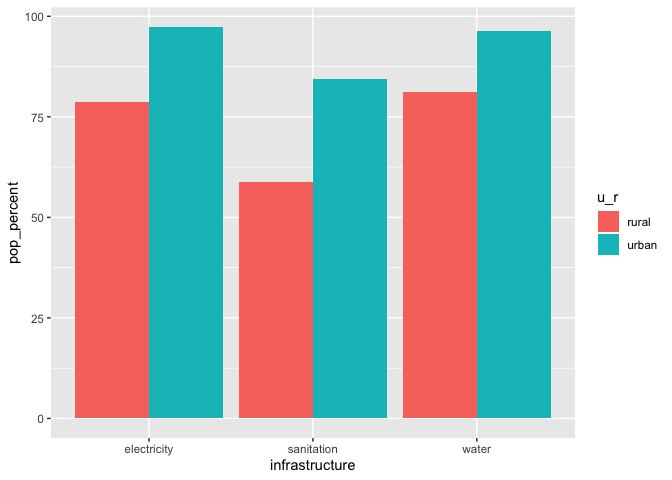
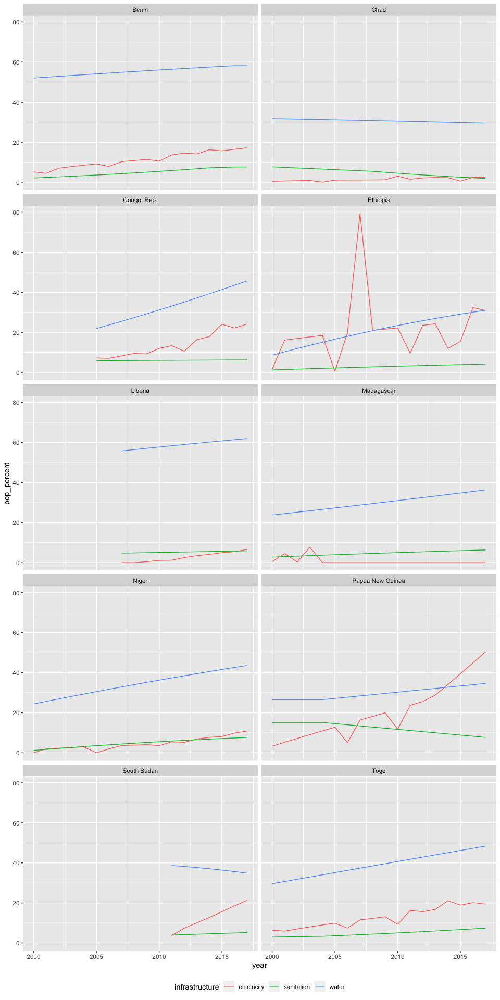
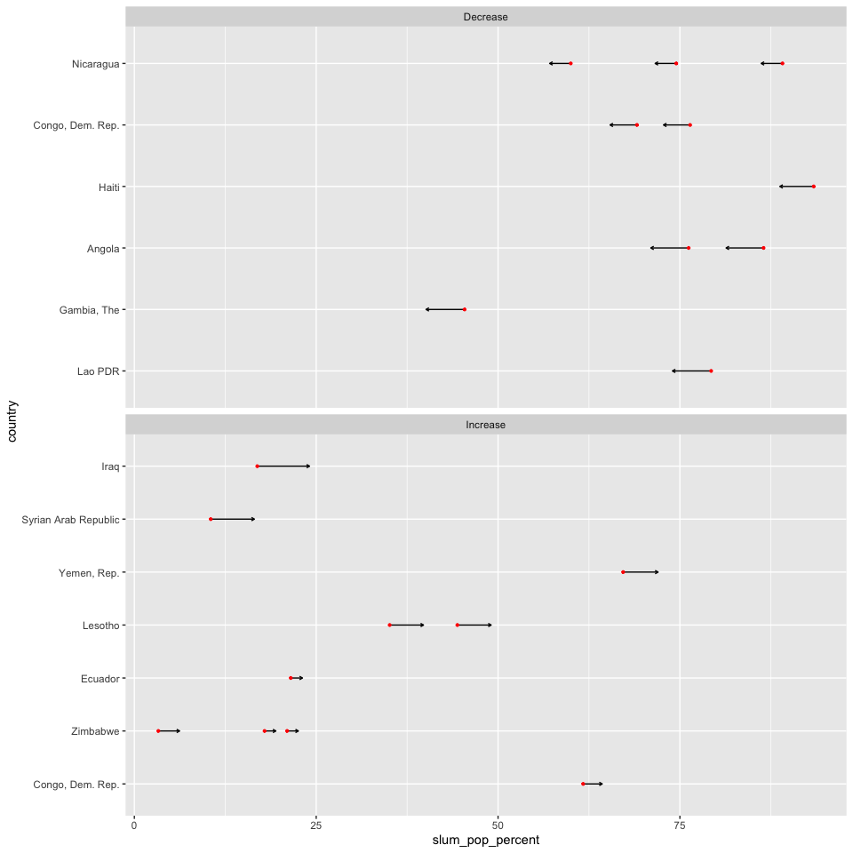
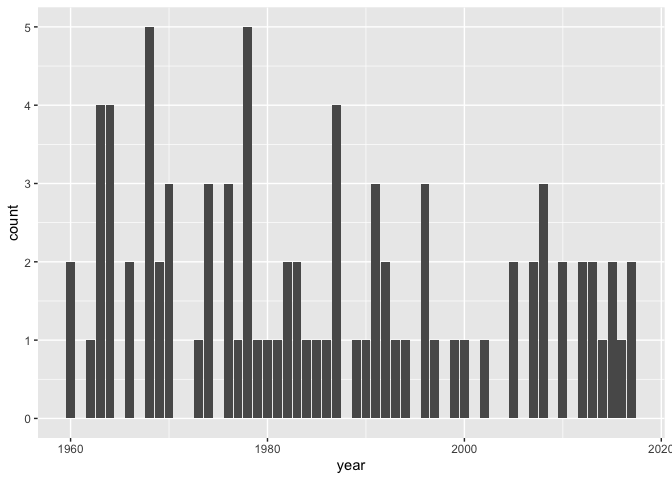

```{r include = FALSE}
knitr::opts_chunk$set(echo = TRUE)
```

## Summary of Progress

Currently, I've lightly explored some of the variables related to infrastructure in the World Bank dataset including, urban growth, urban vs rural population, population living in slums, infrastructure of urban and rural areas (water, sanitation, electricity) and poverty. 

## Key Findings and Insights

Between water, sanitation and electricity, it seems like access to adequate sanitation is less common than access to water and electricity in both rural and urban contexts.


A closer look at the 10 countries with lowest sanitation percentages for rural and urban regions:



I recreated a graph in [The World Bank SDG 11 (Sustainable Cities and Communities)](http://datatopics.worldbank.org/sdgatlas/SDG-11-sustainable-cities-and-communities.html) that was showing the percentage of urban dwellers living in slums but instaead of choosing 2005 to 2014 to find the countries with the highest changes. I found the average increase per year across the entire range of years available and found the top increases and decreases changes. 
 

Counts of the years when countries had more people living in urban areas vs rural areas.



## Issues

An issue I've been facing is determining what groupings to use to study the data (country-specific or region - if region which breakdown). Another issue has been determining what I should graph with all the available indicators. 

## Next Steps

I want to continue to explore the indicators and find trends amongst them. I want to focus more on mapping and adding in transporation indicators.
