Progress report 2
================
Ada Zhou
2020-02-20

  - [Summary of Progress](#summary-of-progress)
  - [Key Findings and Insights](#key-findings-and-insights)
  - [Issues](#issues)
  - [Challenge](#challenge)
  - [Next Steps](#next-steps)

## Summary of Progress

Worked on in-depth look into infrastructure change over the years.
Starting to compare it to urban growth and slum population percent.
Looked more at poverty, urban growth and slum population. Started making
maps.

## Key Findings and Insights

#### Countries where there is a decrease in population access to infrastructure

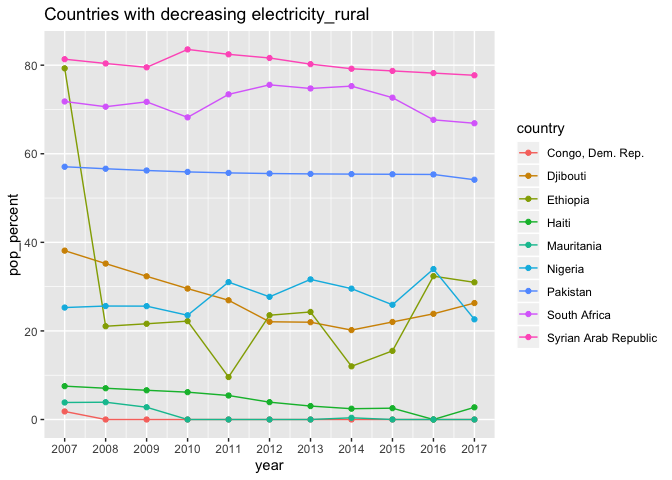
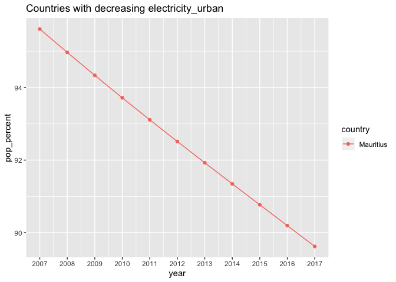
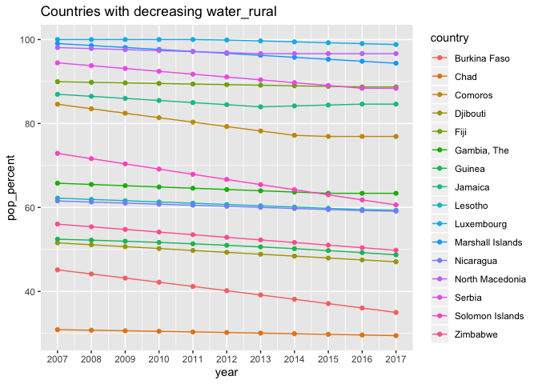
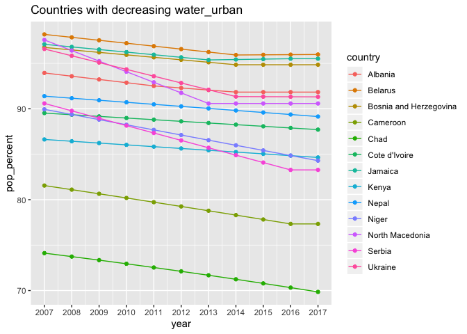

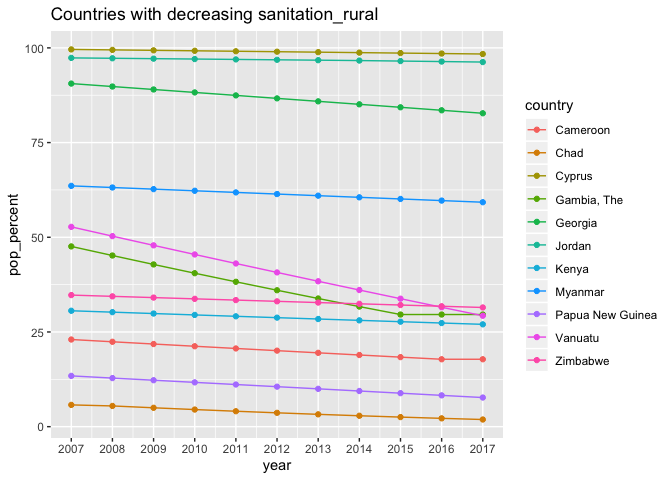
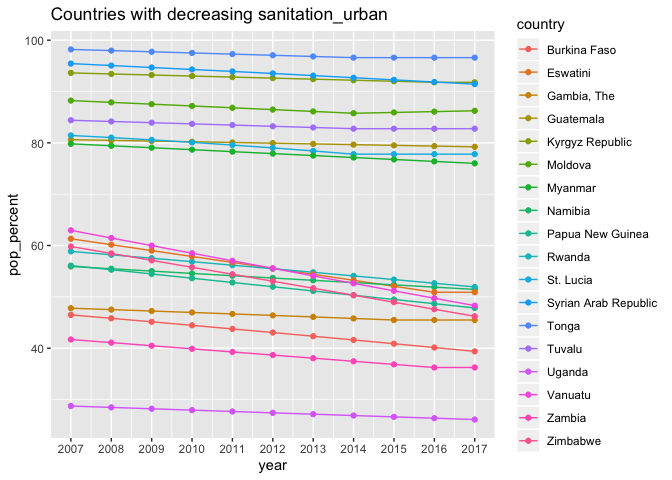

#### Maps of Urban Population Access

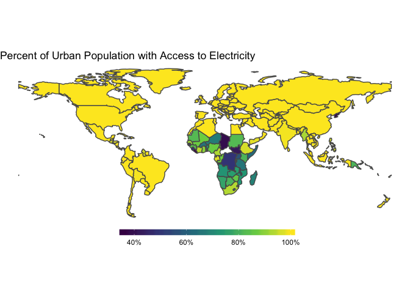
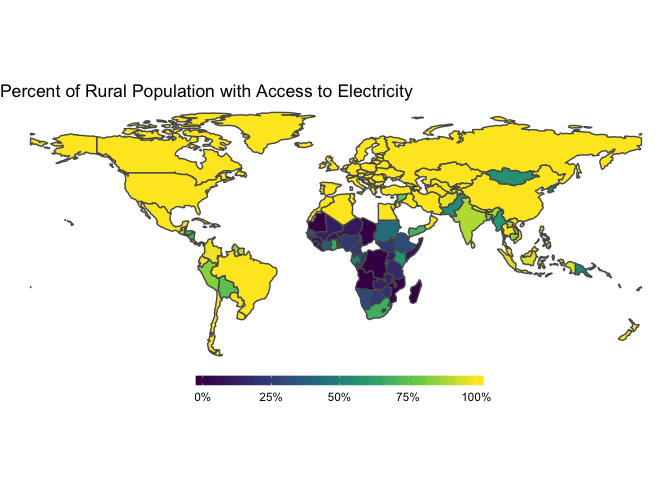
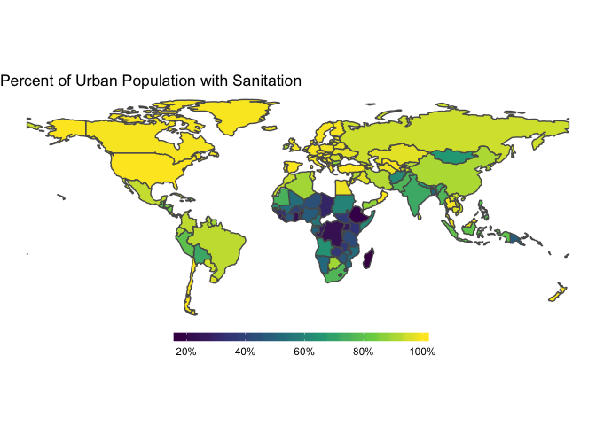
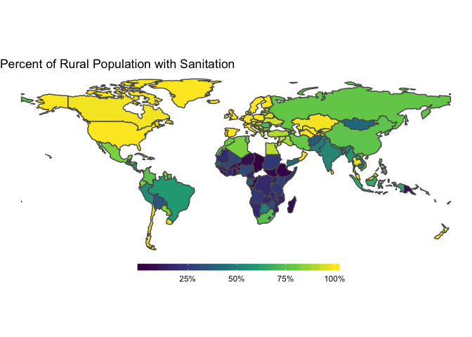
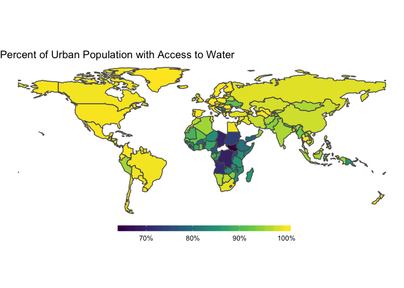
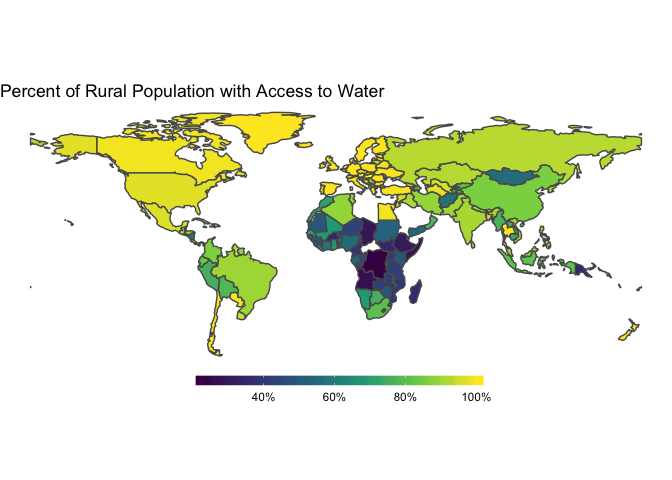

#### Correlations

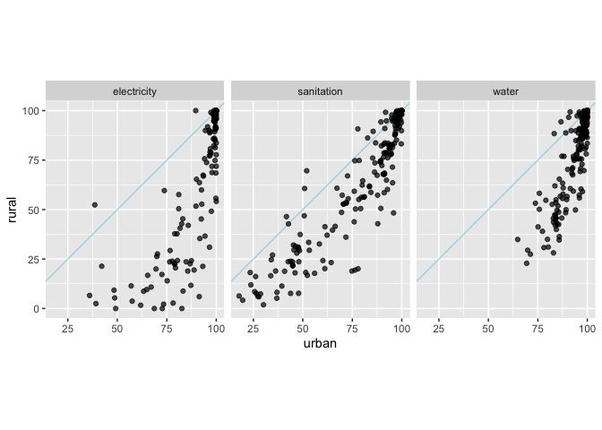
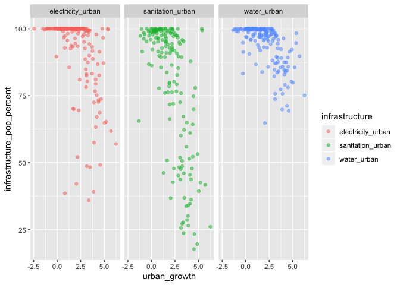

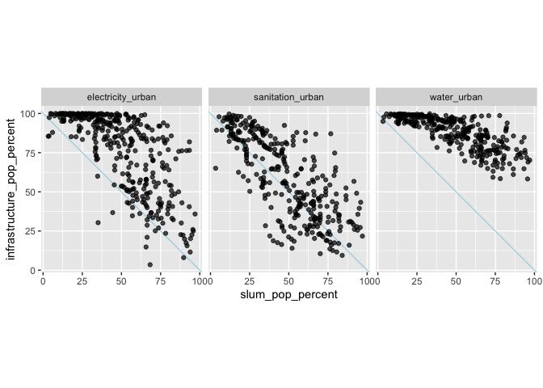

#### Poverty Percentage

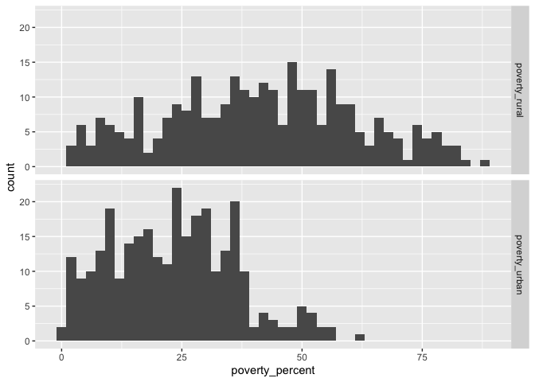

#### Largest Slum Populations (Available)

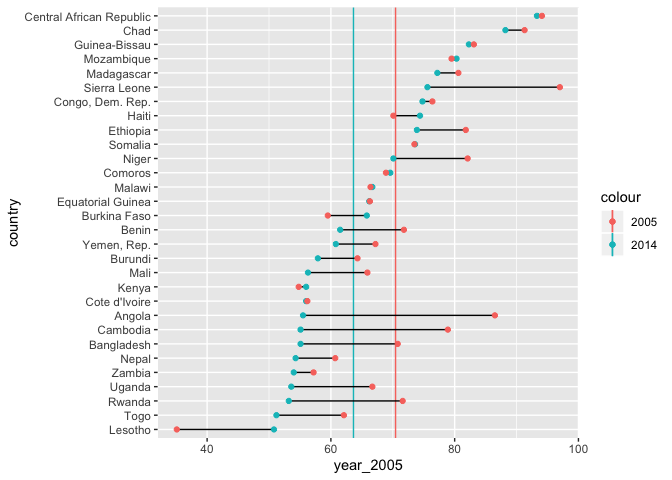

#### Infrastructure difference between urban and rural areas over the years

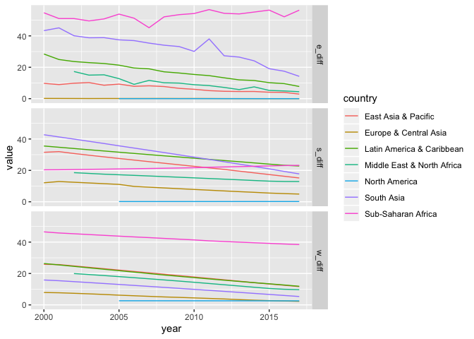

##### Lowest Sanitation Rural

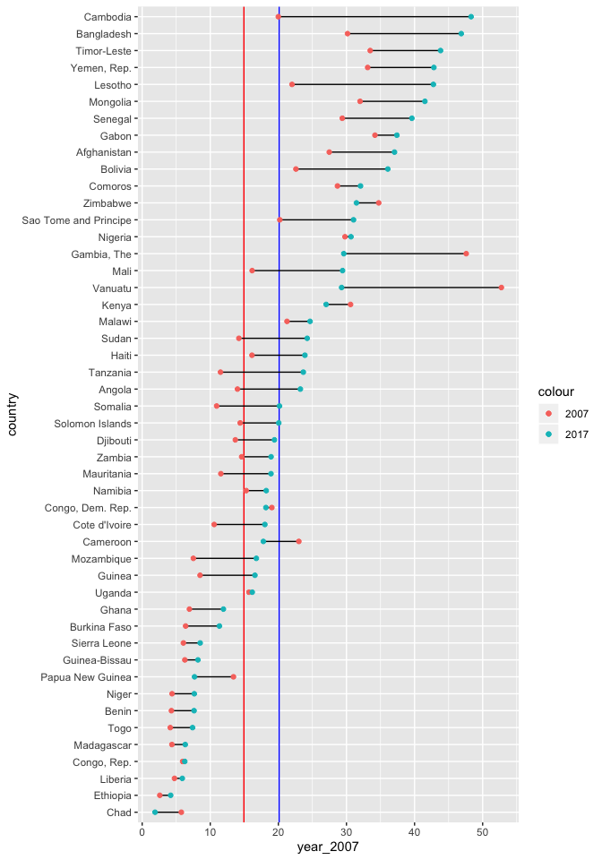

##### Lowest Sanitation Urban

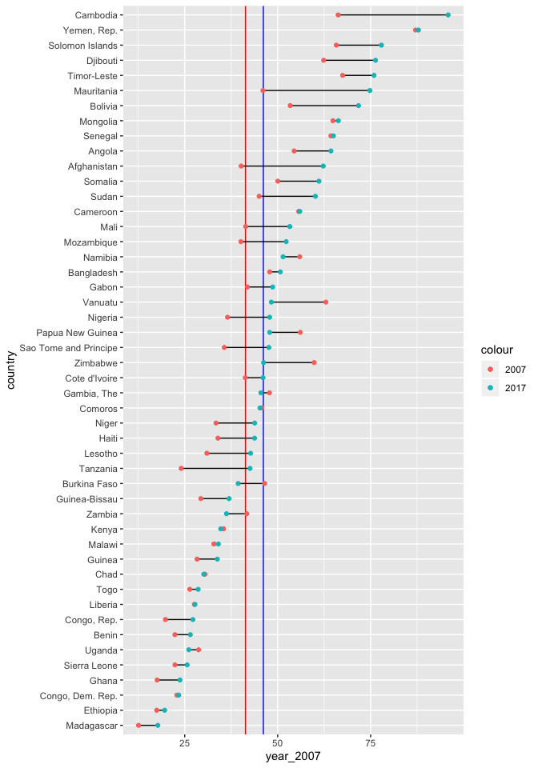

## Issues

Finding list of all countries that belong in each region for graphing.
Can you use a function to make multiple plots with map instead of pmap?

## Challenge

Using functions to graph multiple plots at once. The first step would be
to tidy data to find countries that would be interesting to look at into
more detail in terms of it’s infrastructure changes over the years. Next
would be to write a plotting function that would graph the data for each
country. Lastly, it would be figuring out how to plot graphs for every
interesting country in a few lines.

## Next Steps

Continue to compare the variables and explore the transportation
options, primary industries and total natural resources. Make current
plots presentation quality.
