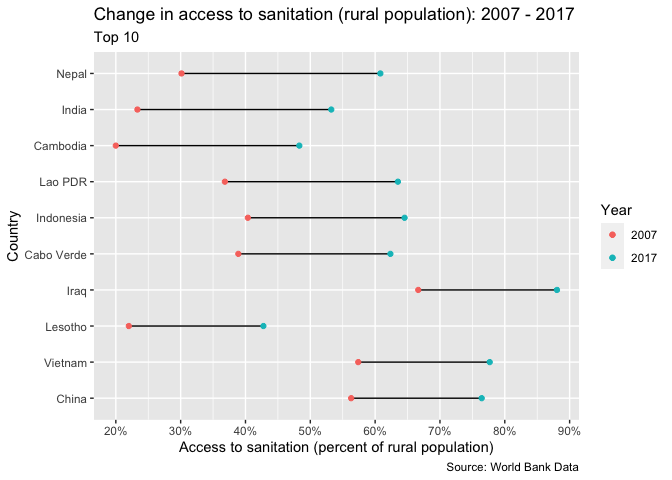
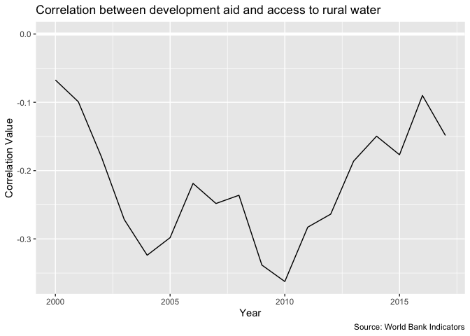
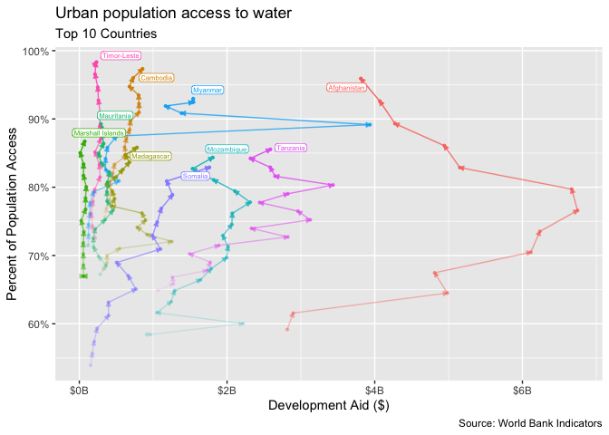
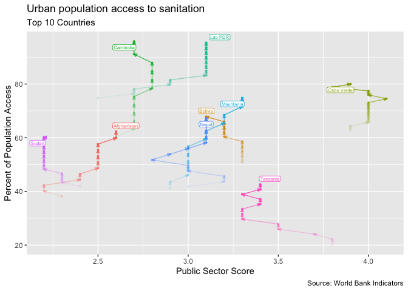
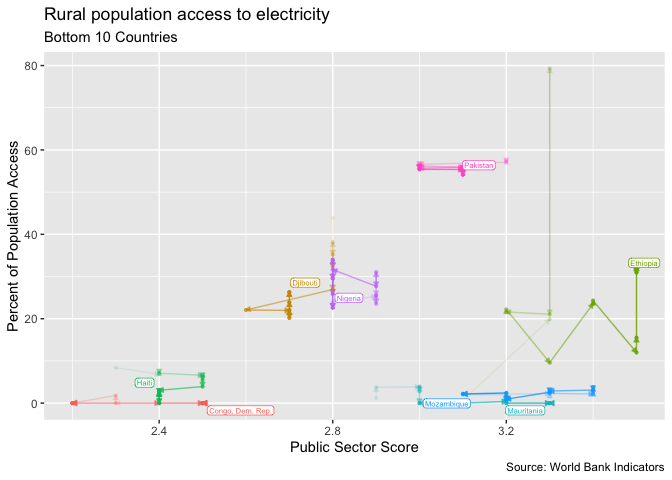

World Infrastructure Final Report
================
Ada
2020-03-17

  - [Introduction](#introduction)
      - [World](#world)
      - [Regions](#regions)
      - [Change in Decade](#change-in-decade)
      - [Correlations](#correlations)
      - [Top 10 Changes + Bottom 10 Changes - Individual
        Countries](#top-10-changes-bottom-10-changes---individual-countries)
      - [Development Aid](#development-aid)
      - [Public Sector Score](#public-sector-score)
      - [Slum Population](#slum-population)
      - [Child Mortality](#child-mortality)

``` r
# Libraries
library(tidyverse)
library(sf)
library(WDI)

# Parameters

  # year min and max for decade change analysis
YEAR_MIN <- 2007
YEAR_MAX <- 2017

  # ISOC2 codes of the world broken up into 7 regions
  # East Asia & Pacific, Europe & Central Asia, Latin America & Caribbean, Middle East & North Africa, North America, South Asia, Sub-Saharan Africa
world_regions <- 
  c(
    "South Asia" = "8S",
    "Sub-Saharan Africa" = "ZG",
    "East Asia & Pacific" = "Z4",
    "Middle East & North Africa" = "ZQ",
    "Europe & Central Asia" = "Z7",
    "Latin America & Caribbean" = "ZJ",
    "North America" = "XU"
  )

  # ISOC2 codes of all grouped regions of the world
group_codes <- 
  c(
    "1A",
    "S3",
    "B8",
    "V2",
    "Z4",
    "4E",
    "T4",
    "XC",
    "Z7",
    "7E",
    "T7",
    "EU",
    "F1",
    "XE",
    "XD",
    "XF",
    "ZT",
    "XH",
    "XI",
    "XG",
    "V3",
    "ZJ",
    "XJ",
    "T2",
    "XL",
    "XO",
    "XM",
    "XN",
    "ZQ",
    "XQ",
    "T3",
    "XP",
    "XU",
    "XY",
    "OE",
    "S4",
    "S2",
    "V4",
    "V1",
    "S1",
    "8S",
    "T5",
    "ZG",
    "ZF",
    "T6",
    "XT",
    "1W"
  )

# data
file_infrastructure <- here::here("c01-own/data/infrastructure.rds")
file_child_mortality <- here::here("c01-own/data/child_mortality.rds")
file_slum_pop_percent <- here::here("c01-own/data/slum_pop_percent.rds")
file_development_aid <- here::here("c01-own/data/development_aid.rds")
file_public_sector_score <- here::here("c01-own/data/public_sector_score.rds")

ROBINSON <- "+proj=robin +lon_0=0 +x_0=0 +y_0=0 +ellps=WGS84 +datum=WGS84 +units=m +no_defs"
file_map <- 
  here::here(
    "../../archive/ne_110m_admin_0_countries/ne_110m_admin_0_countries.shp"
  )
file_region_country <- 
  here::here(
    "c01-own/data-raw/region_country.csv"
  )

infrastructure <- read_rds(file_infrastructure)
child_mortality <- read_rds(file_child_mortality)
slum_pop_percent <- read_rds(file_slum_pop_percent)
development_aid <- read_rds(file_development_aid)
public_sector_score <- read_rds(file_public_sector_score)

world_map <- 
  file_map %>% 
  read_sf() %>%
  filter(NAME != "Antarctica") %>% 
  st_transform(ROBINSON)
  
region_country <- read_csv(file_region_country)
```

``` r
infrastructure <- 
  infrastructure %>% 
  drop_na(
    electricity_urban, 
    electricity_rural,
    water_urban,
    water_rural,
    sanitation_urban,
    sanitation_rural
  ) %>% 
  pivot_longer(
    cols = c(contains("urban"), contains("rural")),
    names_to = c("infrastructure", "u_r"),
    names_sep = "_",
    values_to = "pop_percent"
  )
```

## Introduction

The World Bank collects annual data to measure development progress
across the entire world. The three main infrastructure variables that
they record are people’s access to electricity, sanitation and water.
They divide that into percent of urban and rural population access.

The following looks at the progress of access to the three
infrastructures around the world.

### World

First, we’ll look at the current state of the world in terms of these
three infrastructures.

``` r
infrastructure %>% 
  filter(iso2c == "1W", year == YEAR_MAX) %>% 
  ggplot(aes(x = infrastructure, y = pop_percent, fill = u_r)) +
  geom_col(position = "dodge") +
  scale_x_discrete(labels = c("Electricity", "Sanitation", "Water")) +
  scale_fill_discrete(labels = c("Rural", "Urban")) +
  theme(
    plot.caption = element_text(size = 3)
  ) +
  labs(
    title = str_glue("{YEAR_MAX} World Population Access to Infrastructure"),
    x = "Infrastructure Type",
    y = "Percent of Population",
    fill = "Population Type",
    caption = "Source: World Bank Indicators - EG.ELC.ACCS.UR.ZS, EG.ELC.ACCS.RU.ZS, SH.H2O.BASW.UR.ZS, SH.H2O.BASW.RU.ZS, SH.STA.BASS.UR.ZS, SH.STA.BASS.RU.ZS"
  )
```

<!-- -->

For the most year of data collected, 2017, we see that in general rural
populations have less access to infrastructure than urban populations.
We also see that sanitation is lacking while electricity and water are
neck and neck.

``` r
infrastructure_type_recode <- 
  c(
    "electricity_urban" = "Electricity - Urban",
    "electricity_rural" = "Electricity - Rural",
    "sanitation_urban" = "Santiation - Urban",
    "sanitation_rural" = "Sanitation - Rural",
    "water_urban" = "Water - Urban",
    "water_rural" = "Water - Rural"
  )

infrastructure %>% 
  unite(col = infrastructure_u_r, infrastructure, u_r, remove = FALSE) %>%
  filter(iso2c == "1W") %>% 
  ggplot(aes(x = year, y = pop_percent, color = infrastructure_u_r)) +
  geom_line() +
  geom_point() +
  ggrepel::geom_text_repel(
    aes(label = recode(infrastructure_u_r, !!! infrastructure_type_recode)),
    hjust = -0.1,
    size = 2,
    direction = "y",
    data = . %>% group_by(infrastructure_u_r) %>% filter(year == max(year))
  ) +
  scale_x_continuous(
    breaks = seq(2000, 2017, by = 2),
    limits = c(2000, 2018.5)
  ) +
  scale_y_continuous(
    breaks = scales::breaks_width(10),
    label = scales::label_percent(scale = 1)
  ) +
  theme(
    legend.position = "none",
    plot.caption = element_text(size = 3)
  ) +
  labs(
    title = "World Population's Access to Infrastructure",
    x = "Year",
    y = "Percent of Population",
    color = "Infrastructure",
    captions = 
      "Source: World Bank Indicators - EG.ELC.ACCS.UR.ZS, EG.ELC.ACCS.RU.ZS, SH.H2O.BASW.UR.ZS, SH.H2O.BASW.RU.ZS, SH.STA.BASS.UR.ZS, SH.STA.BASS.RU.ZS"
  )
```

<!-- -->

Looking at the progress of the world from 2000 (the year the World Bank
started recording this data) to 2017, we see that sanitation in rural
areas has continuously been lacking. In general, improvements to each
infrastructure type are happening at consistent rates. Electricity and
water are accessible to most people living in urban environments however
sanitation is only available to about 80% of the world’s urban
population. Water, electricity and sanitation are less available to the
world’s rural populations with sanitation lagging behind water and
electricity. Interestingly, whereas electricity and water are nearly
identical for urban populations, in rural populations, water is
consistently more available.

### Regions

In this section, we’ll dive deeper into trends about these three
infrastructures by region.

``` r
country_infrastructure <- 
  infrastructure %>% 
  pivot_wider(
    names_from = c(infrastructure, u_r, year), 
    values_from = pop_percent
  ) %>% 
  left_join(world_map, ., by = c("ISO_A2" = "iso2c"))


maps_infrastructure <- function(infrastructure_type_year, ...) {
  country_infrastructure %>% 
    ggplot() +
    geom_sf(aes(fill = {{infrastructure_type_year}})) +
    scale_fill_viridis_c(
      breaks = scales::breaks_width(10),
      labels = scales::label_percent(scale = 1)
    ) +
    guides(
      fill = 
        guide_colorbar(
          barheight = 0.5,
          barwidth = 15,
          title = NULL
        )
    ) +
    theme_void() +
    theme(legend.position = "bottom") +
    labs(...)
}
```

``` r
maps_infrastructure(
  electricity_urban_2007, 
  title = "Percent of Urban Population with Access to Electricity in 2007",
  caption = "Source: World Bank Indicators - EG.ELC.ACCS.UR.ZS"
)
```

<!-- -->

``` r
maps_infrastructure(
  electricity_urban_2017, 
  title = "Percent of Urban Population with Access to Electricity in 2017",
  caption = "Source: World Bank Indicators - EG.ELC.ACCS.UR.ZS"
)
```

<!-- -->

Many of the same countries that had low access to electricity in 2007,
remain areas with low access compared to the rest of the countries.

``` r
maps_infrastructure(
  electricity_rural_2007, 
  title = "Percent of Rural Population with Access to Electricity in 2007",
  caption = "Source: World Bank Indicators - EG.ELC.ACCS.RU.ZS"
)
```

<!-- -->

``` r
maps_infrastructure(
  electricity_rural_2017, 
  title = "Percent of Rural Population with Access to Electricity in 2017",
  caption = "Source: World Bank Indicators - EG.ELC.ACCS.RU.ZS"
)
```

<!-- -->

Many countries have low access to electricity in rural areas, with some
countries not having much improvement in the decade.

``` r
maps_infrastructure(
  sanitation_urban_2007,
  title = "Percent of Urban Population with Sanitation in 2007",
  caption = "Source: World Bank Indicators - SH.STA.BASS.UR.ZS"
) 
```

<!-- -->

``` r
maps_infrastructure(
  sanitation_urban_2017,
  title = "Percent of Urban Population with Sanitation in 2017",
  caption = "Source: World Bank Indicators - SH.STA.BASS.UR.ZS"
) 
```

<!-- -->

Whereas both maps above showed most countries either had very high or
very low access to electricity, sanitation shows more of a range of
percents.

``` r
maps_infrastructure(
  sanitation_rural_2007, 
  title = "Percent of Rural Population with Sanitation in 2007",
  caption = "Source: World Bank Indicators - SH.STA.BASS.RU.ZS"
) 
```

<!-- -->

``` r
maps_infrastructure(
  sanitation_rural_2017, 
  title = "Percent of Rural Population with Sanitation in 2017",
  caption = "Source: World Bank Indicators - SH.STA.BASS.RU.ZS"
) 
```

<!-- -->

Even more so than sanitation for urban populations, sanitation for rural
populations are scattered across the spectrum.

``` r
maps_infrastructure(
  water_urban_2007,
  title = "Percent of Urban Population with Access to Water in 2007",
  caption = "Source: World Bank Indicators - SH.H2O.BASW.UR.ZS"
)
```

<!-- -->

``` r
maps_infrastructure(
  water_urban_2017,
  title = "Percent of Urban Population with Access to Water in 2017",
  caption = "Source: World Bank Indicators - SH.H2O.BASW.UR.ZS"
)
```

<!-- -->

``` r
maps_infrastructure(
  water_rural_2017,
  title = "Percent of Rural Population with Access to Water in 2017",
  caption = "Source: World Bank Indicators - SH.H2O.BASW.RU.ZS"
) 
```

<!-- -->

``` r
maps_infrastructure(
  water_rural_2007,
  title = "Percent of Rural Population with Access to Water in 2007",
  caption = "Source: World Bank Indicators - SH.H2O.BASW.RU.ZS"
)
```

<!-- -->

``` r
infrastructure %>% 
  filter(iso2c %in% world_regions) %>%
  mutate(
    u_r = ordered(
      u_r,
      levels = c("urban", "rural"),
      labels = c("Urban", "Rural")
    ),
    infrastructure = 
      ordered(
        infrastructure, 
        levels = c("water", "electricity", "sanitation"),
        labels = c("Water", "Electricity", "Sanitation")
      )
  ) %>% 
  ggplot(aes(year, pop_percent, color = u_r)) +
  geom_hline(yintercept = 100) +
  geom_line() +
  geom_point() +
  facet_grid(rows = vars(country), cols = vars(infrastructure)) +
  scale_x_continuous(
    breaks = scales::breaks_width(4),
    minor_breaks = NULL
  ) +
  scale_y_continuous(labels = scales::percent_format(scale = 1)) +
  theme(
    plot.caption = element_text(size = 5)
  ) +
  labs(
    title = "Percent of population with access to infrastructure across world regions",
    x = "Year",
    y = "Access to Infrastructure (Percent of Population)",
    color = "Population",
    caption = "Source: World Bank Indicators - EG.ELC.ACCS.UR.ZS, EG.ELC.ACCS.RU.ZS, SH.H2O.BASW.UR.ZS, SH.H2O.BASW.RU.ZS, SH.STA.BASS.UR.ZS, SH.STA.BASS.RU.ZS"
  )
```

<!-- -->

The above gives a look into the infrastructures over time for each
region. The 7 regions are one of the ways the World Bank breaks up the
world.

### Change in Decade

The following section looks at the changes in regions between the decade
of 2007 - 2017.

``` r
infrastructure %>% 
  filter(
    !(iso2c %in% group_codes),
    year %in% c("2007", "2017")
  ) %>%
  mutate(
    u_r = ordered(
      u_r,
      levels = c("urban", "rural"),
      labels = c("Urban", "Rural")
    ),
    infrastructure = 
      ordered(
        infrastructure, 
        levels = c("water", "electricity", "sanitation"),
        labels = c("Water", "Electricity", "Sanitation")
      )
  ) %>% 
  drop_na(pop_percent) %>%
  group_by(infrastructure, u_r, iso2c) %>% 
  arrange(iso2c, infrastructure, u_r, year) %>% 
  summarize(
    decade_change = 
      last(pop_percent, year) - first(pop_percent, year)
  ) %>% 
  ungroup() %>% 
  ggplot(aes(decade_change)) +
  geom_histogram(binwidth = 5) +
  geom_vline(
    aes(xintercept = median, color = "median"),
    data = 
      . %>% 
      group_by(infrastructure, u_r) %>% 
      summarize(median = median(decade_change))
  ) +
  geom_vline(xintercept = 0, color = "black") +
  facet_grid(rows = vars(infrastructure), cols = vars(u_r)) +
  scale_x_continuous(
    breaks = scales::breaks_width(25),
    labels = scales::percent_format(scale = 1)
  ) +
  theme(
    legend.position = "bottom",
    plot.caption = element_text(size = 4)
  ) +
  labs(
    title = str_glue("Distribution of change to access to infrastructure from {YEAR_MIN} - {YEAR_MAX}"),
    x = "Difference in Access to Infrastructure (Percent of Population)",
    y = NULL,
    color = NULL,
    caption = "Source: World Bank Indicators - EG.ELC.ACCS.UR.ZS, EG.ELC.ACCS.RU.ZS, SH.H2O.BASW.UR.ZS, SH.H2O.BASW.RU.ZS, SH.STA.BASS.UR.ZS, SH.STA.BASS.RU.ZS"
  )
```

<!-- -->

Overall changes in access to infrastructureare positive with access in
rural populations increasing. Electricity access in particular increased
by a lot for some countries.

### Correlations

``` r
infrastructure %>%
  pivot_wider(
    names_from = u_r,
    values_from = pop_percent
  ) %>%
  filter(
    !(iso2c %in% group_codes),
    year == YEAR_MAX
  ) %>%
  drop_na(urban, rural) %>%
  left_join(region_country, by = c("country" = "CountryName")) %>%
  ggplot(aes(urban, rural, color = GroupName)) +
  geom_abline(slope = 1, color = "light blue") +
  geom_vline(
    aes(xintercept = urban_median),
    color = "white",
    size = 1,
    data = 
      . %>% 
      group_by(infrastructure) %>% 
      summarize(urban_median = median(urban))
  ) +
  geom_hline(
    aes(yintercept = rural_median),
    color = "white",
    size = 1,
    data = 
      . %>% 
      group_by(infrastructure) %>% 
      summarize(rural_median = median(rural))
  ) + 
  geom_point(alpha = 0.5, size = 1) +
  facet_grid(cols = vars(infrastructure)) +
  coord_fixed() +
  theme(
    legend.position = "bottom",
    plot.caption = element_text(size = 4)
  ) +
  labs(
    title = "Urban and rural populations' access to infrastructure",
    x = "Percent Access for Urban Populations",
    y = "Percent Access for Rural Populations",
    color = "Region",
    caption = "Source: World Bank Indicators - EG.ELC.ACCS.UR.ZS, EG.ELC.ACCS.RU.ZS, SH.H2O.BASW.UR.ZS, SH.H2O.BASW.RU.ZS, SH.STA.BASS.UR.ZS, SH.STA.BASS.RU.ZS"
  )
```

<!-- -->

Looking at the relationship between access for urban populations and
access for rural populations, the relative percentages for sanitation
are much closer than electricity or water.

``` r
infrastructure %>%
  pivot_wider(
    names_from = u_r,
    values_from = pop_percent
  ) %>%
  filter(
    !(iso2c %in% group_codes)
  ) %>%
  drop_na(urban, rural) %>% 
  left_join(region_country, by = c("country" = "CountryName")) %>%
  group_by(year, infrastructure) %>%
  summarize(r = cor(urban, rural)) %>% 
  drop_na(r) %>% 
  ggplot(aes(
    year, 
    r, 
    color = fct_relevel(infrastructure, "sanitation", "water", "electricity"))
  ) +
  geom_line() +
  theme(
    plot.caption = element_text(size = 4), 
    plot.title = element_text(size = 10)
  ) +
  labs(
    title = "Correlation Between Urban and Rural Populations Access to Infrastructure",
    x = "Year",
    y = "Correlation",
    color = "Infrastructure",
    caption = "Source: World Bank Indicators - EG.ELC.ACCS.UR.ZS, EG.ELC.ACCS.RU.ZS, SH.H2O.BASW.UR.ZS, SH.H2O.BASW.RU.ZS, SH.STA.BASS.UR.ZS, SH.STA.BASS.RU.ZS"
  )
```

<!-- -->

The above shows that sanitation in urban areas and rural areas are more
highly correlated than water and electricity. This could suggest that
sanitation structures are similar between rural and urban areas.

``` r
infrastructure %>%
  pivot_wider(
    names_from = u_r,
    values_from = pop_percent
  ) %>%
  filter(
    !(iso2c %in% group_codes)
  ) %>%
  left_join(region_country, by = c("country" = "CountryName")) %>%
  group_by(year, infrastructure, GroupName) %>%
  summarize(r = cor(urban, rural)) %>% 
  ungroup() %>% 
  drop_na(r) %>%
  mutate(
    group = if_else(GroupName == "South Asia", "South Asia", "Others"),
    infrastructure = 
      ordered(
        infrastructure, 
        levels = c("water", "electricity", "sanitation"),
        labels = c("Water", "Electricity", "Sanitation")
      )
  ) %>% 
  filter(GroupName != "North America") %>% 
  ggplot(aes(year, r, color = group, group = GroupName)) +
  geom_line() +
  facet_wrap(vars(infrastructure)) +
  scale_color_manual(
    values = c("grey", "red"),
    guide = "none"
  ) +
  theme(
    legend.position = "bottom",
    plot.caption = element_text(size = 4)
  ) +
  labs(
    title = "Correlation Between Urban and Rural Populations Access to Infrastructure",
    subtitle = "South Asia",
    x = "Year",
    y = "Correlation",
    caption = "Source: World Bank Indicators - EG.ELC.ACCS.UR.ZS, EG.ELC.ACCS.RU.ZS, SH.H2O.BASW.UR.ZS, SH.H2O.BASW.RU.ZS, SH.STA.BASS.UR.ZS, SH.STA.BASS.RU.ZS"
  )
```

    ## Warning in cor(urban, rural): the standard deviation is zero
    
    ## Warning in cor(urban, rural): the standard deviation is zero
    
    ## Warning in cor(urban, rural): the standard deviation is zero
    
    ## Warning in cor(urban, rural): the standard deviation is zero
    
    ## Warning in cor(urban, rural): the standard deviation is zero
    
    ## Warning in cor(urban, rural): the standard deviation is zero
    
    ## Warning in cor(urban, rural): the standard deviation is zero
    
    ## Warning in cor(urban, rural): the standard deviation is zero
    
    ## Warning in cor(urban, rural): the standard deviation is zero
    
    ## Warning in cor(urban, rural): the standard deviation is zero
    
    ## Warning in cor(urban, rural): the standard deviation is zero
    
    ## Warning in cor(urban, rural): the standard deviation is zero
    
    ## Warning in cor(urban, rural): the standard deviation is zero

<!-- -->

When looking at region-specific correlation data, South Asia in
particular sticks out with its trends across the years. Around 2012,
both water and electicity fall in correlatin. In general, sanitation is
more consistently predictable if you have urban or rural population
access data.

``` r
infrastructure %>%
  pivot_wider(
    names_from = u_r,
    values_from = pop_percent
  ) %>%
  filter(
    !(iso2c %in% group_codes)
  ) %>%
  left_join(region_country, by = c("country" = "CountryName")) %>%
  filter(GroupName == "South Asia") %>% 
  drop_na(urban, rural) %>% 
  group_by(year, country) %>%
  summarize(r = cor(urban, rural)) %>% 
  ggplot(aes(year, r, color = country)) +
  geom_line() +
  ggrepel::geom_text_repel(
    aes(label = country), 
    size = 2,
    hjust = -0.2,
    direction = "y",
    data = . %>% group_by(country) %>% filter(year == max(year))
  ) +
  scale_x_continuous(limits = c(2000, 2019)) +
  theme(legend.position = "none") +
  labs(
    title = "Urban-Rural Correlation for Countries in South Asia",
    x = "Year",
    y = "Correlation"
  )
```

<!-- -->

``` r
infrastructure %>%
  pivot_wider(
    names_from = u_r,
    values_from = pop_percent
  ) %>%
  filter(
    country == "Maldives"
  ) %>% 
  group_by(infrastructure) %>%
  arrange(year) %>% 
  ggplot(aes(urban, rural, alpha = year)) +
  geom_path() +
  geom_point() +
  geom_text(
    aes(label = year),
    size = 2,
    hjust = 1.7,
    nudge_x = 0.1,
    nudge_y = 0.1,
    data = . %>% group_by(infrastructure) %>% filter(year == 2012)
  ) +
  facet_wrap(vars(infrastructure)) +
  theme(legend.position = "none") +
  labs(
    title = "Maldives",
    x = "Percent Access for Urban Population",
    y = "Percent Access for Rural Population"
  )
```

<!-- -->

Taking a closer look at South Asian countries, we can see that Maldives
has a similar drop in correlation that mirrors the general South Asia
correlation. Taking a closer look at those countries, we see in the
Maldives that electricity and water in rural populations rapidly
increased wihtout much change to urban population likely because access
to water and electricity was already very high. Sanitation, however,
hold steady improvements that seems to slow down in 2014.

### Top 10 Changes + Bottom 10 Changes - Individual Countries

``` r
decade_top <- function(type, u_r, n) {
  infrastructure %>% 
    filter(
      !(iso2c %in% group_codes),
      year %in% c({YEAR_MIN}, {YEAR_MAX}),
      infrastructure == {{type}},
      u_r == {{u_r}}
    ) %>% 
    drop_na(pop_percent) %>% 
    group_by(iso2c, country) %>% 
    arrange(year) %>% 
    summarize(
      decade_change = 
        last(pop_percent, year) - first(pop_percent, year)
    ) %>% 
    ungroup() %>% 
    top_n(n, decade_change) %>% 
    filter(decade_change != 0)
}


plot_decade_change <- function(type, u_r, n) {
  infrastructure %>% 
    filter(
      iso2c %in% (decade_top({{type}}, {{u_r}}, n) %>% pull(iso2c)),
      u_r == {{u_r}},
      infrastructure == {{type}}
    ) %>% 
    pivot_wider(
      names_from = year,
      names_prefix = "year_",
      values_from = "pop_percent"
    ) %>% 
    mutate(
      decade_change = year_2017 - year_2007,
      country = fct_reorder(country, abs(decade_change))
    ) %>%
    ggplot(aes(y = country)) +
    geom_segment(
      aes(
        x = year_2007, 
        xend = year_2017, 
        y = country, 
        yend = country
      )
    ) +
    geom_point(aes(x = year_2007, color = "2007")) +
    geom_point(aes(x = year_2017, color = "2017")) +
    scale_x_continuous(
      breaks = scales::breaks_width(10),
      labels = scales::percent_format(scale = 1)
    ) +
    labs(
      title = 
        str_glue("Change in access to {type} ({u_r} population): {YEAR_MIN} - {YEAR_MAX}"),
      subtitle = str_glue("Top {n}"),
      x = str_glue("Access to {type} (percent of {u_r} population)"),
      y = "Country",
      color = "Year",
      caption = "Source: World Bank Data"
    )
}

plot_decade_change("sanitation", "rural", 10)
```

<!-- -->

``` r
plot_decade_change("sanitation", "urban", 10)
```

<!-- -->

``` r
plot_decade_change("water", "rural", 10)
```

<!-- -->

``` r
plot_decade_change("water", "urban", 10)
```

<!-- -->

``` r
plot_decade_change("electricity", "rural", 10)
```

<!-- -->

``` r
plot_decade_change("electricity", "urban", 10)
```

<!-- -->

``` r
plot_decade_change("sanitation", "rural", -10)
```

<!-- -->

``` r
plot_decade_change("sanitation", "urban", -10)
```

<!-- -->

``` r
plot_decade_change("water", "rural", -10)
```

<!-- -->

``` r
plot_decade_change("water", "urban", -10)
```

<!-- -->

``` r
plot_decade_change("electricity", "rural", -10)
```

<!-- -->

``` r
plot_decade_change("electricity", "urban", -10)
```

<!-- -->

The charts above highlight the top or bottom 10 countries where access
to infrastructure changed. There are some countries where the access to
infrastrucute decreased instead of increased.

``` r
graph_country <- function(country) {
  infrastructure %>% 
    filter(
      country == {{country}}
    ) %>% 
    drop_na(pop_percent) %>% 
    ggplot(aes(x = year, y = pop_percent, color = u_r)) +
    geom_line() +
    geom_point() +
    facet_grid(rows = vars(infrastructure)) +
    scale_x_continuous(breaks = scales::breaks_width(2)) +
    scale_y_continuous(
      breaks = scales::breaks_width(20),
      labels = scales::percent_format(scale = 1)
    ) +
    labs(
      title = str_glue("{country} data"),
      x = "Year",
      y = "Access to infrastructure (Percent of Population)",
      color = "Population Type",
      caption = "Source: World Bank Data"
    )
}

bottom_urban_sanitation_plots <- 
  decade_top("sanitation", "urban", -10) %>% 
  left_join(
    infrastructure %>% distinct(iso2c, country), 
    by = c("iso2c", "country")
  ) %>% 
  select(country) %>% 
  pmap(graph_country)

bottom_urban_sanitation_plots %>% walk(print)
```

<!-- --><!-- --><!-- --><!-- --><!-- --><!-- --><!-- --><!-- --><!-- --><!-- -->

``` r
top_urban_sanitation_plots <- 
  decade_top("sanitation", "urban", 10) %>% 
  left_join(
    infrastructure %>% distinct(iso2c, country), 
    by = c("iso2c", "country")
  ) %>% 
  select(country) %>% 
  pmap(graph_country)

top_urban_sanitation_plots %>% walk(print)
```

<!-- --><!-- --><!-- --><!-- --><!-- --><!-- --><!-- --><!-- --><!-- --><!-- -->

Sanitation for urban population decreases for the decade 2007 - 2017 for
every single country, in fact, it’s decreasing even before 2007. Rwanda
and Eswatini’s sanitation for rural population is actually increasing as
sanitation for urban population decreases, even changing over to where
higher percentage of rural populations have access to sanitation than
urban. In Myanmar, while sanitation access decreases for both urban and
rural populations, water increases. In Burkina Faso, Myanmar, Papua New
Guinea, Rwanda, Eswatini, Vanatu, and Zambia sanitation for urban
populations decreases but electricity and water slightly increase for
urban populations.

### Development Aid

``` r
region_levels <- c(
  "South Asia",
  "Middle East & North Africa",
  "Europe & Central Asia",
  "East Asia & Pacific",
  "Latin America & Caribbean",
  "Sub-Saharan Africa"
)

infrastructure %>% 
  left_join(
    development_aid,
    by = c("iso2c", "country", "year")
  ) %>% 
  left_join(region_country, by = c("country" = "CountryName")) %>%
  filter(
    !(iso2c %in% group_codes),
    year == YEAR_MAX
  ) %>% 
  drop_na(development_aid) %>%
  mutate(GroupName = fct_relevel(GroupName, !!!region_levels)) %>% 
  ggplot(aes(development_aid, fill = GroupName)) +
  geom_histogram(binwidth = 5e8) +
  geom_vline(aes(xintercept = median(development_aid))) +
  annotate(
    geom = "text", 
    x = 1e7, 
    y = Inf, 
    label = "median",
    hjust = -0.5,
    vjust = 1.4,
    size = 3
  ) +
  scale_x_continuous(
    breaks = scales::breaks_width(1e9),
    label = scales::label_dollar(scale = 1e-9, suffix = "B")
  ) +
  scale_y_continuous(breaks = scales::breaks_width(100)) +
  theme(legend.position = "bottom") +
  labs(
    title = str_glue("Distribution of annual aid amounts in {YEAR_MAX}"),
    x = "Development Aid ($)",
    y = NULL,
    fill = "Region"
  )
```

<!-- -->

There are a few countries that have negative development aid which is
because the World Bank calculates the net official aid thus they gave
more aid than they received. A majority of the countries receive less
than $500 million.

``` r
infrastructure %>% 
  left_join(
    development_aid,
    by = c("iso2c", "country", "year")
  ) %>% 
  left_join(region_country, by = c("country" = "CountryName")) %>%
  filter(!(iso2c %in% group_codes)) %>% 
  drop_na(pop_percent, development_aid) %>%
  count(year, GroupName, wt = development_aid, name = "total_aid") %>% 
  ggplot(aes(year, total_aid, color = GroupName)) + 
  geom_line() +
  ggrepel::geom_text_repel(
    aes(label = GroupName),
    size = 2,
    direction = "y",
    hjust = 0,
    data = . %>% group_by(GroupName) %>% filter(year == max(year))
  ) +
  scale_x_continuous(
    breaks = seq(2000, 2018, by = 2), 
    limits = c(2000, 2020)
  ) +
  scale_y_continuous(
    breaks = scales::breaks_width(50e9),
    label = scales::label_dollar(accuracy = 1, scale = 1e-9, suffix = "B")
  ) +
  theme(legend.position = "none") +
  labs(
    title = "Total aid given to each region",
    x = "Year",
    y = "Total Aid ($)",
    caption = "Source: World Bank Indicators"
  )
```

<!-- -->

In developing countries, aid from philanthropies or other countries is
common. This section looks deeper into whether or not the aid affects
the infrastructure. The above graph shows that Sub-Saharan Africa is the
region receving the most aid followed by MENA and South Asia.

``` r
plot_correlation <- function(infrastructure_type, pop_type) {
  infrastructure %>% 
  left_join(
    development_aid,
    by = c("iso2c", "country", "year")
  ) %>% 
  filter(
    !(iso2c %in% group_codes),
    infrastructure == {{infrastructure_type}},
    u_r == {{pop_type}}
  ) %>% 
  drop_na(pop_percent, development_aid) %>%
  group_by(year) %>% 
  summarise(r = cor(development_aid, pop_percent)) %>% 
  ggplot(aes(year, r)) +
  geom_hline(yintercept = 0, color = "white", size = 1.5) +
  geom_line() +
  labs(
    title = 
      str_glue("Correlation between development aid and access to {pop_type} {infrastructure_type}"),
    x = "Year",
    y = "Correlation Value",
    caption = "Source: World Bank Indicators"
  )
}

correlation_plots <- 
  infrastructure %>% 
  distinct(infrastructure, u_r) %>% 
  select(infrastructure_type = infrastructure, pop_type = u_r) %>% 
  pmap(plot_correlation)

correlation_plots %>% walk(print)
```

<!-- --><!-- --><!-- --><!-- --><!-- --><!-- -->

There doesn’t seem to be a huge correlation between amount of aid money
to any change in infrastructure access for either population. Even so, a
consistent pattern is that the correlation values are mainly negative,
indicating that if there was any connection between aid money and
infrastructure access, it’s more likely that more aid money the less
infrastructure access which checks out because more aid is likely to go
to countries that do not have infrastructure built out.

``` r
plot_top_change <- function(infrastructure_type, pop_type, n) {
  infrastructure %>% 
    left_join(
      development_aid,
      by = c("iso2c", "country", "year")
    ) %>% 
    filter(
      iso2c %in% 
        (decade_top({{infrastructure_type}}, {{pop_type}}, n) %>% pull(iso2c)),
      infrastructure == infrastructure_type,
      u_r == pop_type
    ) %>% 
    drop_na(pop_percent, development_aid) %>%
    arrange(country, year) %>% 
    ggplot(aes(development_aid, pop_percent, color = country, alpha = year)) +
    geom_path(arrow = arrow(length = unit(0.05, "inches"), type = "closed")) +
    geom_point(size = 0.8) +
    ggrepel::geom_label_repel(
      aes(label = country), 
      size = 2,
      label.padding = 0.1,
      data = . %>% group_by(country) %>% filter(year == max(year))
    ) +
    scale_x_continuous(
      label = scales::label_dollar(scale = 1e-9, suffix = "B")
    ) +
    scale_y_continuous(
      label = scales::label_percent(scale = 1)
    ) +
    guides(
      color = "none",
      alpha = "none"
    ) +
    labs(
      title = str_glue("{str_to_title(pop_type)} population access to {infrastructure_type}"),
      x = "Development Aid ($)",
      y = "Percent of Population Access",
      caption = "Source: World Bank Indicators"
    )
}

top_plots <- 
  infrastructure %>% 
  distinct(infrastructure, u_r) %>% 
  select(infrastructure_type = infrastructure, pop_type = u_r) %>%
  pmap(~ plot_top_change(..1, ..2, 10) + labs(subtitle = "Top 10 Countries"))

top_plots %>% walk(print)
```

<!-- --><!-- --><!-- --><!-- --><!-- --><!-- -->

``` r
bottom_plots <- 
  infrastructure %>% 
  distinct(infrastructure, u_r) %>% 
  select(infrastructure_type = infrastructure, pop_type = u_r) %>%
  pmap(
    ~ plot_top_change(..1, ..2, -10) + labs(subtitle = "Bottom 10 Countries")
  )

bottom_plots %>% walk(print)
```

<!-- --><!-- --><!-- --><!-- --><!-- --><!-- -->

The above graphs show that development aid seems to go a small subset of
the top/bottom countries that receive a lot more development aid then
the rest - the access to infrastructure does not seem to play a big role
in the countries that get more aid. Additionally, for the select few
countries with inordinate amounts of development aid there doesn’t seem
to any significant improvement of situation. In fact for the top ten
improved countries, the countries with less aid seemed to have more
improvement (such as the Urban population access to sanitation).

### Public Sector Score

``` r
infrastructure %>% 
  left_join(
    public_sector_score,
    by = c("iso2c", "country", "year")
  ) %>% 
  left_join(region_country, by = c("country" = "CountryName")) %>%
  filter(
    !(iso2c %in% group_codes),
    year == YEAR_MAX
  ) %>%
  mutate(GroupName = fct_relevel(GroupName, !!!region_levels)) %>% 
  drop_na(public_sector_score) %>% 
  ggplot(aes(public_sector_score, fill = GroupName)) +
  geom_histogram(binwidth = 0.1) +
  geom_vline(aes(xintercept = median(public_sector_score))) +
  annotate(
    geom = "text", 
    x = 3, 
    y = Inf, 
    label = "median",
    hjust = 1,
    vjust = 1.4,
    size = 3
  ) +
  scale_x_continuous(
    breaks = scales::breaks_width(1)
  ) +
  scale_y_continuous(breaks = scales::breaks_width(10)) +
  theme(legend.position = "bottom") +
  labs(
    title = str_glue("Distribution of public sector scores in {YEAR_MAX}"),
    x = "Public Sector Score",
    y = NULL,
    fill = "Region"
  )
```

<!-- -->

The median public sector score given by the CPIA which is from 1 (low)
to 6 (high). It’s an aggregate of five variables related to public
sector management and instituitions (property rights and rule-based
governance; quality of budgetary and financial management; efficiency of
revenue mobilization; quality of public administration; transparency,
accountability and corruption in the public sector). In general
countries are scoring pretty low for this set of variables.

``` r
infrastructure %>% 
  left_join(
    public_sector_score,
    by = c("iso2c", "country", "year")
  ) %>% 
  left_join(region_country, by = c("country" = "CountryName")) %>%
  filter(!(iso2c %in% group_codes)) %>% 
  drop_na(pop_percent, public_sector_score) %>%
  group_by(year, GroupName) %>% 
  summarize(median_score = median(public_sector_score)) %>% 
  ggplot(aes(year, median_score, color = GroupName)) + 
  geom_line() +
  ggrepel::geom_text_repel(
    aes(label = GroupName),
    size = 2,
    direction = "y",
    hjust = 0,
    data = . %>% group_by(GroupName) %>% filter(year == max(year))
  ) +
  scale_x_continuous(
    breaks = seq(2005, 2018, by = 2), 
    limits = c(2005, 2019)
  ) +
  theme(legend.position = "none") +
  labs(
    title = "Median public sector score given to each region",
    x = "Year",
    y = "Public Sector Strength Score (out of 6)",
    caption = "Source: World Bank Indicators"
  )
```

<!-- -->

The median score for each region seems to be decreasing or staying the
same. In particular, in the Middle East & North Africa the score has
been decreasing whereas the other regions are around 3 - 3.25

``` r
plot_correlation_score <- function(infrastructure_type, pop_type) {
  infrastructure %>% 
    left_join(
      public_sector_score,
      by = c("iso2c", "country", "year")
    ) %>% 
    filter(
      !(iso2c %in% group_codes),
      infrastructure == {{infrastructure_type}},
      u_r == {{pop_type}}
    ) %>% 
    drop_na(pop_percent, public_sector_score) %>%
    group_by(year) %>% 
    summarise(r = cor(public_sector_score, pop_percent)) %>% 
    ggplot(aes(year, r)) +
    geom_hline(yintercept = 0, color = "white", size = 1.5) +
    geom_line() +
    geom_point() +
    scale_x_continuous(breaks = scales::breaks_width(1)) +
    labs(
      title = 
        str_glue("Correlation between public sector score and access to {pop_type} {infrastructure_type}"),
      x = "Year",
      y = "Correlation Value",
      caption = "Source: World Bank Indicators"
    )
}

score_correlation_plots <- 
  infrastructure %>% 
  distinct(infrastructure, u_r) %>% 
  select(infrastructure_type = infrastructure, pop_type = u_r) %>% 
  pmap(plot_correlation_score)

score_correlation_plots %>% walk(print)
```

<!-- --><!-- --><!-- --><!-- --><!-- --><!-- -->

Similarly to development aid amount there doesn’t seem to be any high
correlation between the public sector score and any of the
infrastructure access percentages. However, unlike the development aid,
it’s positive correlation which means generally the higher the public
sector score, the more likely there’s a higher infrastructure access.

``` r
plot_score_top_change <- function(infrastructure_type, pop_type, n) {
  infrastructure %>% 
    left_join(
      public_sector_score,
      by = c("iso2c", "country", "year")
    ) %>% 
    filter(
      iso2c %in% 
        (decade_top({{infrastructure_type}}, {{pop_type}}, n) %>% pull(iso2c)),
      infrastructure == infrastructure_type,
      u_r == pop_type
    ) %>% 
    drop_na(pop_percent, public_sector_score) %>%
    arrange(country, year) %>% 
    ggplot(
      aes(public_sector_score, pop_percent, color = country, alpha = year)
    ) +
    geom_path(arrow = arrow(length = unit(0.05, "inches"), type = "closed")) +
    geom_point(size = 0.8) +
    ggrepel::geom_label_repel(
      aes(label = country), 
      size = 2,
      label.padding = 0.1,
      data = . %>% group_by(country) %>% filter(year == max(year))
    ) +
    guides(
      color = "none",
      alpha = "none"
    ) +
    labs(
      title = str_glue("{str_to_title(pop_type)} population access to {infrastructure_type}"),
      x = "Public Sector Score",
      y = "Percent of Population Access",
      caption = "Source: World Bank Indicators"
    )
}

score_top_plots <- 
  infrastructure %>% 
  distinct(infrastructure, u_r) %>% 
  select(infrastructure_type = infrastructure, pop_type = u_r) %>%
  pmap(
    ~ plot_score_top_change(..1, ..2, 10) + labs(subtitle = "Top 10 Countries")
  )

score_top_plots %>% walk(print)
```

<!-- --><!-- --><!-- --><!-- --><!-- --><!-- -->

``` r
score_bottom_plots <- 
  infrastructure %>% 
  distinct(infrastructure, u_r) %>% 
  select(infrastructure_type = infrastructure, pop_type = u_r) %>%
  pmap(
    ~ plot_score_top_change(..1, ..2, -10) + 
      labs(subtitle = "Bottom 10 Countries")
  )

score_bottom_plots %>% walk(print)
```

<!-- --><!-- --><!-- --><!-- --><!-- --><!-- -->

There does not seem to be any difference or pattern between the top and
bottom countries (in terms of change in percetage access) of each
infrastructure and population type.

### Slum Population

``` r
infrastructure %>%
  left_join(
    slum_pop_percent,
    by = c("iso2c", "country", "year")
  ) %>% 
  left_join(region_country, by = c("country" = "CountryName")) %>%
  filter(
    !(iso2c %in% group_codes),
    u_r == "urban"
  ) %>%  
  drop_na(slum_pop_percent, pop_percent) %>% 
  ggplot(
    aes(slum_pop_percent, pop_percent, color = GroupName)
  ) +
  geom_abline(slope = -1, intercept = 100, color = "light blue") +
  geom_point(alpha = 0.5) +
  facet_grid(cols = vars(infrastructure)) +
  coord_fixed() +
  theme(
    legend.position = "bottom",
    plot.title = element_text(size = 10),
    plot.caption = element_text(size = 4)
  ) +
  labs(
    title = "Percentage of Urban Population Living in Slums vs Urban Population Access to Infrastructure",
    x = "Percentage of Urban Population Living in Slums",
    y = "Percentage of Urban Population Access",
    color = "Region",
    caption = "Source: World Bank Indicators - EG.ELC.ACCS.UR.ZS, EG.ELC.ACCS.RU.ZS, SH.H2O.BASW.UR.ZS, SH.H2O.BASW.RU.ZS, SH.STA.BASS.UR.ZS, SH.STA.BASS.RU.ZS"
  )
```

<!-- -->

The above graphs show that cities in Sub-Saharan Africa generally have
higher percentages of urban populations living in slums. The lower the
percentage of urban population living in slums, the higher the
percentage access to electricity, sanitation and water.

``` r
infrastructure %>%
  left_join(
    read_rds(file_slum_pop_percent),
    by = c("iso2c", "country", "year")
  ) %>% 
  left_join(region_country, by = c("country" = "CountryName")) %>%
  filter(
    !(iso2c %in% group_codes),
    u_r == "urban"
  ) %>%  
  drop_na(slum_pop_percent, pop_percent) %>% 
  group_by(year, infrastructure) %>% 
  summarize(r = cor(slum_pop_percent, pop_percent)) %>% 
  ggplot(
    aes(year, r, color = infrastructure)
  ) +
  geom_line() +
  geom_point() +
  scale_x_continuous(breaks = scales::breaks_width(2)) +
  theme(
    legend.position = "bottom",
    plot.caption = element_text(size = 4),
    plot.title = element_text(size = 9)
  ) +
  labs(
    title = "Correlation Between Percentage of Population Living in Slums and Urban Population Access to Infrastructure",
    x = "Year",
    y = "Correlation",
    color = "Infrastructure Type",
    caption = "Source: World Bank Indicators - EG.ELC.ACCS.UR.ZS, EG.ELC.ACCS.RU.ZS, SH.H2O.BASW.UR.ZS, SH.H2O.BASW.RU.ZS, SH.STA.BASS.UR.ZS, SH.STA.BASS.RU.ZS"
  )
```

<!-- -->

The lower the percentage of urban dwellers living in slums, the more
likely the higher the access to water, sanitation and electricity for
urban population (in order of correlation for 2014). Water access became
the most highly correlated infrastructure from the least correlated in
2000. Thus in recent years, it is likely that water access in slums is
worse or water access outside of slums has increased or both.

### Child Mortality

``` r
infrastructure_type_recode <- 
  c(
    "electricity_urban" = "Electricity - Urban",
    "electricity_rural" = "Electricity - Rural",
    "sanitation_urban" = "Santiation - Urban",
    "sanitation_rural" = "Sanitation - Rural",
    "water_urban" = "Water - Urban",
    "water_rural" = "Water - Rural"
  )

infrastructure %>% 
  unite(col = infrastructure_u_r, infrastructure, u_r, remove = FALSE) %>% 
  left_join(
    child_mortality,
    by = c("iso2c", "country", "year")
  ) %>%
  drop_na(pop_percent, child_mortality) %>% 
  group_by(year, infrastructure_u_r) %>% 
  summarize(r = cor(pop_percent, child_mortality)) %>% 
  ggplot(aes(year, r, color = infrastructure_u_r)) +
  geom_line() +
  geom_point() +
  ggrepel::geom_text_repel(
    aes(label = recode(infrastructure_u_r, !!! infrastructure_type_recode)),
    hjust = -0.1,
    size = 2,
    direction = "y",
    data = . %>% group_by(infrastructure_u_r) %>% filter(year == max(year))
  ) +
  scale_x_continuous(
    breaks = seq(1990, 2017, by = 2),
    limits = c(2000, 2019)
  ) +
  scale_y_continuous(
    breaks = scales::breaks_width(0.05)
  ) +
  theme(
    legend.position = "none",
    plot.caption = element_text(size = 3)
  ) +
  labs(
    title = "Correlation Between Child Mortality and Population Infrastructure Access",
    x = "Year",
    y = "Correlation",
    captions = 
      "Source: World Bank Indicators - EG.ELC.ACCS.UR.ZS, EG.ELC.ACCS.RU.ZS, SH.H2O.BASW.UR.ZS, SH.H2O.BASW.RU.ZS, SH.STA.BASS.UR.ZS, SH.STA.BASS.RU.ZS"
  )
```

<!-- -->

``` r
infrastructure %>% 
  left_join(
    child_mortality,
    by = c("iso2c", "country", "year")
  ) %>%
  drop_na(pop_percent, child_mortality) %>% 
  group_by(year, infrastructure) %>% 
  summarize(r = cor(pop_percent, child_mortality)) %>% 
  ggplot(aes(year, r, color = infrastructure)) +
  geom_line() +
  geom_point() +
  ggrepel::geom_text_repel(
    aes(label = recode(infrastructure, !!! infrastructure_type_recode)),
    hjust = -0.1,
    size = 2,
    direction = "y",
    data = . %>% group_by(infrastructure) %>% filter(year == max(year))
  ) +
  scale_x_continuous(
    breaks = seq(1990, 2017, by = 2),
    limits = c(2000, 2019)
  ) +
  scale_y_continuous(
    breaks = scales::breaks_width(0.05)
  ) +
  theme(
    legend.position = "none",
    plot.caption = element_text(size = 3)
  ) +
  labs(
    title = "Correlation Between Child Mortality and Infrastructure Access",
    x = "Year",
    y = "Correlation",
    captions = 
      "Source: World Bank Indicators - EG.ELC.ACCS.UR.ZS, EG.ELC.ACCS.RU.ZS, SH.H2O.BASW.UR.ZS, SH.H2O.BASW.RU.ZS, SH.STA.BASS.UR.ZS, SH.STA.BASS.RU.ZS"
  )
```

<!-- -->

Overall child mortality is more corrrelated with sanitation then
electricity and water. Breaking it down between urban and rural
populations, rural electricity is most highly correlated to child
mortality, whereas urban electricity is the least correlated. This could
indicate that the factors that go into electricity in rural areas are
more relevant to child mortality than urban electricity.
