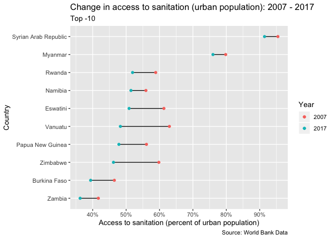

Infrastructure Development
================
Ada Zhou
2019

  - [Introduction](#introduction)
  - [WDI](#wdi)
  - [Gather and tidy data](#gather-and-tidy-data)
  - [Initial, general overview](#initial-general-overview)
  - [Answers](#answers)

``` r
# Libraries
library(tidyverse)
library(WDI)

# Parameters

  # year min and max for decade change analysis
YEAR_MIN <- 2007
YEAR_MAX <- 2017

  # file of data
file_data <- here::here("")

  # ISOC2 codes of the world broken up into 7 regions
  # East Asia & Pacific, Europe & Central Asia, Latin America & Caribbean, Middle East & North Africa, North America, South Asia, Sub-Saharan Africa
world_regions <- 
  c(
    "8S",
    "ZG",
    "Z4",
    "ZQ",
    "Z7",
    "ZJ",
    "XU"
  )

  # ISOC2 codes of all grouped regions of the world
group_codes <- 
  c(
    "1A",
    "S3",
    "B8",
    "V2",
    "Z4",
    "4E",
    "T4",
    "XC",
    "Z7",
    "7E",
    "T7",
    "EU",
    "F1",
    "XE",
    "XD",
    "XF",
    "ZT",
    "XH",
    "XI",
    "XG",
    "V3",
    "ZJ",
    "XJ",
    "T2",
    "XL",
    "XO",
    "XM",
    "XN",
    "ZQ",
    "XQ",
    "T3",
    "XP",
    "XU",
    "XY",
    "OE",
    "S4",
    "S2",
    "V4",
    "V1",
    "S1",
    "8S",
    "T5",
    "ZG",
    "ZF",
    "T6",
    "XT",
    "1W"
  )


file_data <- here::here("c01-own/data/infrastructure.rds")

# variables for reading in data
indicators <- 
  c(
    "electricity_urban" = "EG.ELC.ACCS.UR.ZS",
    "electricity_rural" = "EG.ELC.ACCS.RU.ZS",
    "water_urban" = "SH.H2O.BASW.UR.ZS",
    "water_rural" = "SH.H2O.BASW.RU.ZS",
    "sanitation_urban" = "SH.STA.BASS.UR.ZS",
    "sanitation_rural" = "SH.STA.BASS.RU.ZS"
  )

# Countries
country <- "all"

# Years Range
start <- NULL
end <- NULL

  # File where generated answers are saved, by default in the home directory
file_answers <- "~/answers.rds"
  # Save answers
SAVE_ANSWERS <- TRUE
```

### Introduction

Currently the World Bank estimates that over 55% of the worlds 4+
million population live in urban areas. Additionally more than 80% of
global GDP is generated in cities. But now are people’s quality of lives
as urbanization increases?

The World Bank estimates that around 90% of urban expansion in
developing countries are being built through informal and unplanned
settlements. In this challenge, you will look at data on urban and rural
population access to three main infrastructures: electricity, water and
sanitation. What are some stories of successful urbanization or
successful rural life in terms of accessibility to basic infrastructure
for populations? What are some stories of struggle?

### WDI

You will use the data from the World Development Indicators Dataset. The
“World Development Indicators (WDI) is the primary World Bank collection
of development indicators, compiled from officially recognized
international sources. It presents the most current and accurate global
development data available, and includes national, regional and global
estimates.”

You can access WDI using the WDI API which is loaded for you above.
Documentation for using the WDI API can be found
[here](https://cran.r-project.org/web/packages/WDI/WDI.pdf).

### Gather and tidy data

**q1** Pull indicators for access to electricity (% of urban
population), access to electricity (% of rural population), access to
water (% of urban population), access to water (% of rural population),
access to sanitation (% of urban population) and access to sanitation (%
of rural population) from all available years and all available
countries using a WDI API call. You can look for indicator codes using
`WDIsearch` which is also covered in the WDI API documentation
[above](https://cran.r-project.org/web/packages/WDI/WDI.pdf).

If you are having trouble with reading in the indicators with the WDI,
there is a `infrastructure.rds` file in the \[box\]
(<https://stanford.app.box.com/folder/104836386745>) is what it should
be.

Save the data into a tibble `q1`.

``` r
q1 <- 
  read_rds(file_data)
# WDI(country = country, indicator = indicators, start = start, end = end)
```

**q2** Tidy and clean data so that there is a column for
`infrastructure`, `u_r` (urban or rural) and `population_percent`. Save
your cleaned data in a tibble `q2`.

``` r
q2 <- 
  q1 %>% 
  drop_na(
    electricity_urban, 
    electricity_rural,
    water_urban,
    water_rural,
    sanitation_urban,
    sanitation_rural
  ) %>% 
  pivot_longer(
    cols = c(contains("urban"), contains("rural")),
    names_to = c("infrastructure", "u_r"),
    names_sep = "_",
    values_to = "population_percent"
  )
```

### Initial, general overview

**q3** Graph the access to electricity, water and sanitation in urban
and rural areas for every world region using the vector `world_regions`
which contains all iso2c codes of the 7 world regions used by the World
Bank. What information does the graphs tell you about the state of
infrastructure access? Which infrastructure looks to be lagging behind?

``` r
q3 <- 
  q2 %>% 
  filter(iso2c %in% world_regions) %>%
  mutate(
    u_r = ordered(
      u_r,
      levels = c("urban", "rural"),
      labels = c("Urban", "Rural")
    ),
    infrastructure = 
      ordered(
        infrastructure, 
        levels = c("water", "electricity", "sanitation"),
        labels = c("Water", "Electricity", "Sanitation")
      )
  ) %>% 
  ggplot(aes(year, population_percent, color = u_r)) +
  geom_hline(yintercept = 100) +
  geom_line() +
  geom_point() +
  facet_grid(rows = vars(country), cols = vars(infrastructure)) +
  scale_x_continuous(
    breaks = scales::breaks_width(4),
    minor_breaks = NULL
  ) +
  scale_y_continuous(labels = scales::percent_format(scale = 1)) +
  labs(
    title = "Percent of population with access to infrastructure across world regions",
    x = "Year",
    y = "Access to Infrastructure (Percent of Population)",
    color = "Population",
    captions = "Source: World Bank Data"
  )
```

  - Many of the changes in population access for both rural and urban
    populations for all infrastructures, across regions is linear -
    likely something to do with the way World Bank calculates these
    percentages
  - Rural populations consistently have less access to all three
    infrastructures across regions
  - Sanitation is generally the infratructure that populations have less
    access to, then it’s electricity, then it’s water
  - Interestingly, a small percentage of North America rural populations
    seem to not have access to water even though electricity and
    sanitation are at 100%
  - Generally across world regions, infrastructure access has been
    increasing for both populations
  - Generally rural access to infrastructure seems to be increasing at a
    higher rate per year than urban access
  - MENA urban access nearly at 100% but not quite and hasn’t changed
    much in between 2000 - 2017
  - Interesting spike in 2007 for rural access to electricity in
    Sub-Saharan Africa
  - Interesting downward spike in 2011 for rural access to electrcity in
    South Africa

#### Top Ten and Bottom Ten

Now let’s take a closer look at the top ten most improved and the bottom
ten least improved infrastructure situations in the decade between
2007-2017 for each infrastructure type.

**q4.1** First write a function named `decade_top` that takes in three
variables - `infrastructure`, `u_r` and `n` - that will return the top
`n` countries in terms of population percent access change between
2007-2017 for the infrastructure and population type. Resulting tibble
should have `iso2c` and `decade_change` as columns.

Find the top ten decade change in infrastructure situations for
electricity urban, electricity rural, water urban, water rural,
sanitation urban, and sanitation rural and bottom ten decade change in
infrastructure situations for electricity urban, electricity rural,
water urban, water rural, sanitation urban, and sanitation rural (code
provided) with your function.

Answers for what each resulting tibble should be are provided for you to
use to compare if desired.

Hints: Use the vector `group_codes` to select only country-level data.
Filter out any decade changes that are equal to zero.

``` r
decade_top <- function(infrastructure, u_r, n) {
  q2 %>% 
    filter(
      !(iso2c %in% group_codes),
      year %in% c({YEAR_MIN}, {YEAR_MAX}),
      infrastructure == {{infrastructure}},
      u_r == {{u_r}}
    ) %>% 
    drop_na(population_percent) %>% 
    group_by(iso2c) %>% 
    arrange(year) %>% 
    summarize(
      decade_change = 
        last(population_percent, year) - first(population_percent, year)
    ) %>% 
    top_n(n, decade_change) %>% 
    filter(
      decade_change != 0
    )
}

q4_sanitation_rural <- decade_top("sanitation", "rural", 10)
q4_sanitation_urban <- decade_top("sanitation", "urban", 10)
q4_water_rural <- decade_top("water", "rural", 10)
q4_water_urban <- decade_top("water", "urban", 10)
q4_electricity_rural <- decade_top("electricity", "rural", 10)
q4_electricity_urban <- decade_top("electricity", "urban", 10)

q4_sanitation_rural_bottom <- decade_top("sanitation", "rural", -10)
q4_sanitation_urban_bottom <- decade_top("sanitation", "urban", -10)
q4_water_rural_bottom <- decade_top("water", "rural", -10)
q4_water_urban_bottom <- decade_top("water", "urban", -10)
q4_electricity_rural_bottom <- decade_top("electricity", "rural", -10)
q4_electricity_urban_bottom <- decade_top("electricity", "urban", -10)

q4_sanitation_rural
```

    ## # A tibble: 10 x 2
    ##    iso2c decade_change
    ##    <chr>         <dbl>
    ##  1 CN             20.1
    ##  2 CV             23.5
    ##  3 ID             24.2
    ##  4 IN             29.9
    ##  5 IQ             21.4
    ##  6 KH             28.3
    ##  7 LA             26.7
    ##  8 LS             20.8
    ##  9 NP             30.7
    ## 10 VN             20.3

``` r
q4_sanitation_urban
```

    ## # A tibble: 10 x 2
    ##    iso2c decade_change
    ##    <chr>         <dbl>
    ##  1 AF             22.1
    ##  2 BO             18.4
    ##  3 CV             14.2
    ##  4 IQ             14.1
    ##  5 KH             29.6
    ##  6 LA             17.2
    ##  7 MR             28.8
    ##  8 NP             21.6
    ##  9 SD             15.1
    ## 10 TZ             18.5

``` r
q4_water_rural
```

    ## # A tibble: 10 x 2
    ##    iso2c decade_change
    ##    <chr>         <dbl>
    ##  1 AF             23.6
    ##  2 CG             20.2
    ##  3 IQ             22.5
    ##  4 LA             22.2
    ##  5 MA             25.6
    ##  6 MM             22.7
    ##  7 MZ             21.6
    ##  8 PY             27.0
    ##  9 SV             23.1
    ## 10 TL             20.0

``` r
q4_water_urban
```

    ## # A tibble: 10 x 2
    ##    iso2c decade_change
    ##    <chr>         <dbl>
    ##  1 AF             31.4
    ##  2 KH             12.7
    ##  3 MG             10.7
    ##  4 MH             16.5
    ##  5 MM             13.7
    ##  6 MR             14.0
    ##  7 MZ             16.3
    ##  8 SO             19.8
    ##  9 TL             16.8
    ## 10 TZ             12.8

``` r
q4_electricity_rural
```

    ## # A tibble: 10 x 2
    ##    iso2c decade_change
    ##    <chr>         <dbl>
    ##  1 AF             78.7
    ##  2 BD             48.9
    ##  3 CV             40.9
    ##  4 KH             61.6
    ##  5 LA             41.6
    ##  6 MH             69.5
    ##  7 NP             47.7
    ##  8 PE             45.0
    ##  9 SB             59.5
    ## 10 TL             51.9

``` r
q4_electricity_urban
```

    ## # A tibble: 10 x 2
    ##    iso2c decade_change
    ##    <chr>         <dbl>
    ##  1 CG             34.6
    ##  2 LR             29.1
    ##  3 LS             32.8
    ##  4 ML             32.1
    ##  5 MZ             32.4
    ##  6 RW             35.2
    ##  7 SO             25.6
    ##  8 SZ             28.8
    ##  9 TG             25.9
    ## 10 ZM             27.4

``` r
q4_sanitation_rural_bottom
```

    ## # A tibble: 10 x 2
    ##    iso2c decade_change
    ##    <chr>         <dbl>
    ##  1 CM            -5.21
    ##  2 CY            -1.21
    ##  3 GE            -7.84
    ##  4 GM           -18.0 
    ##  5 KE            -3.58
    ##  6 MM            -4.32
    ##  7 PG            -5.72
    ##  8 TD            -3.86
    ##  9 VU           -23.5 
    ## 10 ZW            -3.27

``` r
q4_sanitation_urban_bottom
```

    ## # A tibble: 10 x 2
    ##    iso2c decade_change
    ##    <chr>         <dbl>
    ##  1 BF            -7.11
    ##  2 MM            -3.81
    ##  3 NA            -4.48
    ##  4 PG            -8.25
    ##  5 RW            -6.93
    ##  6 SY            -4.00
    ##  7 SZ           -10.4 
    ##  8 VU           -14.7 
    ##  9 ZM            -5.45
    ## 10 ZW           -13.6

``` r
q4_water_rural_bottom
```

    ## # A tibble: 10 x 2
    ##    iso2c decade_change
    ##    <chr>         <dbl>
    ##  1 BF           -10.1 
    ##  2 DJ            -4.51
    ##  3 GN            -3.72
    ##  4 KM            -7.68
    ##  5 LS            -2.90
    ##  6 MH            -4.69
    ##  7 NI            -2.44
    ##  8 RS            -6.08
    ##  9 SB           -12.3 
    ## 10 ZW            -6.23

``` r
q4_water_urban_bottom
```

    ## # A tibble: 10 x 2
    ##    iso2c decade_change
    ##    <chr>         <dbl>
    ##  1 AL            -2.11
    ##  2 BY            -2.21
    ##  3 CM            -4.22
    ##  4 KE            -1.98
    ##  5 MK            -6.99
    ##  6 NE            -5.65
    ##  7 NP            -2.25
    ##  8 RS            -7.32
    ##  9 TD            -4.27
    ## 10 UA            -5.27

``` r
q4_electricity_rural_bottom
```

    ## # A tibble: 10 x 2
    ##    iso2c decade_change
    ##    <chr>         <dbl>
    ##  1 CD          -1.82  
    ##  2 DJ         -11.8   
    ##  3 ET         -48.3   
    ##  4 HT          -4.78  
    ##  5 MR          -3.84  
    ##  6 MZ          -0.0969
    ##  7 NG          -2.66  
    ##  8 PK          -2.93  
    ##  9 SY          -3.63  
    ## 10 ZA          -4.92

``` r
q4_electricity_urban_bottom
```

    ## # A tibble: 4 x 2
    ##   iso2c decade_change
    ##   <chr>         <dbl>
    ## 1 CR           -0.117
    ## 2 MU           -5.99 
    ## 3 NA           -0.945
    ## 4 TJ           -0.257

**q4.2** Write a function to visualize each country and its change in
population access percent between 2007-2017. Function should take in at
least these three variables - `infrastructure`, `u_r` and `n`.

Use the function to create 12 visualizations: top ten decade change in
infrastructure situations for electricity urban, electricity rural,
water urban, water rural, sanitation urban, and sanitation rural and
bottom ten decade change in infrastructure situations for electricity
urban, electricity rural, water urban, water rural, sanitation urban,
and sanitation rural (code provided).

Hints: Use function written in `q4.1` in this function. E09 Viz

``` r
plot_decade_change <- function(infrastructure, u_r, n) {
  q2 %>% 
    filter(
      iso2c %in% (decade_top({{infrastructure}}, {{u_r}}, n) %>% pull(iso2c)),
      u_r == {{u_r}},
      infrastructure == {{infrastructure}}
    ) %>% 
    pivot_wider(
      names_from = year,
      names_prefix = "year_",
      values_from = "population_percent"
    ) %>% 
    mutate(country = fct_reorder(country, year_2017)) %>%
    ggplot(aes(y = country)) +
    geom_segment(
      aes(
        x = year_2007, 
        xend = year_2017, 
        y = country, 
        yend = country
      )
    ) +
    geom_point(aes(x = year_2007, color = "2007")) +
    geom_point(aes(x = year_2017, color = "2017")) +
    scale_x_continuous(
      breaks = scales::breaks_width(10),
      labels = scales::percent_format(scale = 1)
    ) +
    labs(
      title = 
        str_glue("Change in access to {infrastructure} ({u_r} population): {YEAR_MIN} - {YEAR_MAX}"),
      subtitle = str_glue("Top {n}"),
      x = str_glue("Access to {infrastructure} (percent of {u_r} population)"),
      y = "Country",
      color = "Year",
      caption = "Source: World Bank Data"
    )
}

plot_decade_change("sanitation", "rural", 10)
```

<!-- -->

``` r
plot_decade_change("sanitation", "urban", 10)
```

<!-- -->

``` r
plot_decade_change("water", "rural", 10)
```

<!-- -->

``` r
plot_decade_change("water", "urban", 10)
```

<!-- -->

``` r
plot_decade_change("electricity", "rural", 10)
```

<!-- -->

``` r
plot_decade_change("electricity", "urban", 10)
```

<!-- -->

``` r
plot_decade_change("sanitation", "rural", -10)
```

<!-- -->

``` r
plot_decade_change("sanitation", "urban", -10)
```

<!-- -->

``` r
plot_decade_change("water", "rural", -10)
```

<!-- -->

``` r
plot_decade_change("water", "urban", -10)
```

<!-- -->

``` r
plot_decade_change("electricity", "rural", -10)
```

<!-- -->

``` r
plot_decade_change("electricity", "urban", -10)
```

<!-- -->

#### Focusing on individual country data

**q5.1** Write a function to graph all the data (urban and rural
population, electricity, sanitation and water infrastructures) across
all available years on an individual country with `country` as a
parameter.

``` r
graph_country <- function(country) {
  q2 %>% 
    filter(
      country == {{country}}
    ) %>% 
    drop_na(population_percent) %>% 
    ggplot(aes(x = year, y = population_percent, color = u_r)) +
    geom_line() +
    geom_point() +
    facet_grid(rows = vars(infrastructure)) +
    scale_x_continuous(breaks = scales::breaks_width(2)) +
    scale_y_continuous(
      breaks = scales::breaks_width(20),
      labels = scales::percent_format(scale = 1)
    ) +
    labs(
      title = str_glue("{country} data"),
      x = "Year",
      y = "Access to infrastructure (Percent of Population)",
      color = "Urban or Rural",
      caption = "Source: World Bank Data"
    )
}
```

**q5.2** Use the function from `q5.1` to graph each countries data in
the bottom 10 of change in sanitation access for urban populations
between 2007-2017.

What do you notice about each country? Does the decrease in santiation
access mean anything for electricity or water access?

Hint: Use the function from q4.1 and q2

``` r
change_plots <- 
  decade_top("sanitation", "urban", -10) %>% 
  left_join(q2 %>% distinct(iso2c, country), by = "iso2c") %>% 
  select(country) %>% 
  pmap(graph_country)

change_plots %>% walk(print)
```

<!-- --><!-- --><!-- --><!-- --><!-- --><!-- --><!-- --><!-- --><!-- --><!-- -->

  - Sanitation for urban population decreases for the decade 2007 - 2017
    for every single country, in fact, it’s decreasing even before 2007
  - Rwanda and Eswatini’s sanitation for rural population is actually
    increasing as sanitation for urban population decreases, even
    changing over to where higher percentage of rural populations have
    access to sanitation than urban
  - In Myanmar, while sanitation access decreases for both urban and
    rural populations, water increases
  - In Burkina Faso, Myanmar, Papua New Guinea, Rwanda, Eswatini,
    Vanatu, and Zambia sanitation for urban populations decreases but
    electricity and water slightly increase for urban populations

## Answers

To create an RDS file with answers, save all of your solutions in
variables such as `q1`, `q2.1`, etc. The following code will create an
answer file when you knit the solution.Rmd file. You specify where the
answer file is saved using the `file_answers` variable in the
parameters.

To provide answers, set `eval=TRUE` in the chunk below. If you will not
be providing answers, simply delete the following lines.

Save answers.

``` r
if (SAVE_ANSWERS) {
  ls(pattern = "^q[1-9][0-9]*") %>%
    str_sort(numeric = TRUE) %>% 
    set_names() %>% 
    map(get) %>%
    discard(is.ggplot) %>%
    write_rds(file_answers)
}
```
